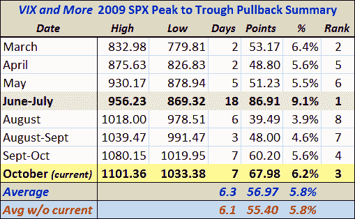

<!--yml

分类：未分类

date: 2024-05-18 17:24:06

-->

# VIX and More: Pullback Surpasses 2009 Mean

> 来源：[`vixandmore.blogspot.com/2009/10/pullback-surpasses-2009-mean.html#0001-01-01`](http://vixandmore.blogspot.com/2009/10/pullback-surpasses-2009-mean.html#0001-01-01)

虽然这可能不会给多头带来太大的安慰，但我已经更新了 VIX and More 回调表，以反映今天的卖盘。表显示，SPX 从高点到低点的 67.98 点（6.2%）的跌幅已经超过了 2009 年的平均 5.8%。

如前所述，SPX 从 1101 点的 5.8%回调确立了一个目标低点 1037。今天 SPX 已经触及 1033.38 点。

从图表来看，如果 1034 点无法坚守，我预期会在 1015-1020 点看到额外的支撑。与此同时，那些勇敢地遵循[VIX 的大幅波动历史](http://vixandmore.blogspot.com/2009/10/vix-spike-of-35-in-four-days-is-short.html)或[ strangleg pong](http://vixandmore.blogspot.com/2009/10/strangle-pong.html)策略的交易者应该对未来持看涨态度。

对于相关文章，读者们被鼓励去查看：

[编辑：数据截至东部时间 3:10]

