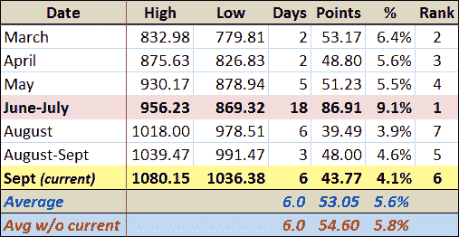

<!--yml

分类：未分类

日期：2024-05-18 17:27:59

-->

# VIX 和更多：2009 年牛市中的回调

> 来源：[`vixandmore.blogspot.com/2009/10/pullbacks-in-2009-bull-market.html#0001-01-01`](http://vixandmore.blogspot.com/2009/10/pullbacks-in-2009-bull-market.html#0001-01-01)

今天交易时段接近一半时，标普 500 指数创下了 1036.38 的日内低点，这低于最近 9 月 25 日的低点 1041.17，比 9 月 23 日的高点 1080.15 低约 4.1%。

这次 4.1%的回调是自今年 3 月开始的当前牛市以来的第七次重大回调。下面的表格总结了从日内高点到日内低点的所有 3.9%或以上的回调。当前的回调，用黄色突出显示，在从高点到低点的时间跨度上排名第二。然而，就回调的幅度而言，4.1%在七次回调中排名第六。当前回调之前的平均回调为 5.84%。将平均回调应用于 1080.15 的高点，意味着回调至大约 SPX 1017。

一些其他的技术因素让我在 1020-1025 区域寻找支撑。如果这一支撑未能显现，我不会感到惊讶，很快就会看到 SPX 1017 被迅速击穿，SPX 很快就会测试 1000 点。

尽管如此，在所有条件相同的情况下，没有理由假设最近的短期且回调幅度较浅的历史不应该延续到未来，SPX 1100 比 SPX 1000 更有可能是下一个止损点。

