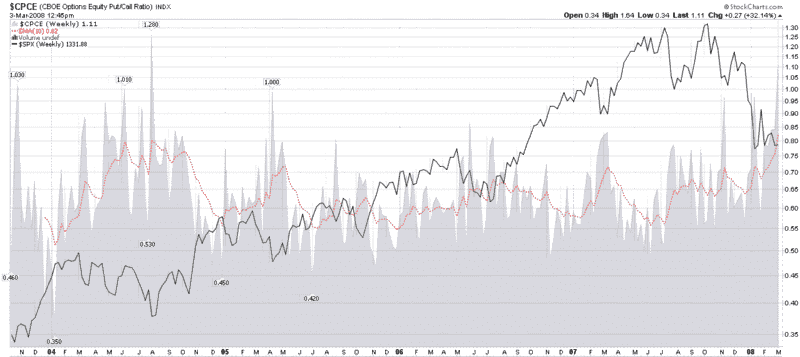

<!--yml

分类：未分类

日期：2024-05-18 18:41:50

-->

# VIX 和更多：极端水平的看跌/看涨比数据

> 来源：[`vixandmore.blogspot.com/2008/03/put-to-call-data-at-extreme-levels.html#0001-01-01`](http://vixandmore.blogspot.com/2008/03/put-to-call-data-at-extreme-levels.html#0001-01-01)

[今天早上早些时候](http://vixandmore.blogspot.com/2008/03/put-to-calls-and-trin-more-skittish.html)，我提到[ISEE](http://vixandmore.blogspot.com/search/label/ISEE)每天都在创纪录地达到所有时间最低的 20、50 和 100 简单移动平均值，并指出 CBOE 股票看跌/看涨比数字也创下了纪录水平。我认为图表可能会更好地讲述这个故事，所以我附上了 CBOE 股票看跌/看涨比率的周图表。

图表追溯到 CBOE 开始发布仅包含股票看跌/看涨比数据的时间点，并使用 10 周 EMA 作为平滑函数。如图所示，当前 EMA 的 82 是一个新纪录，超过了 2004 年 8 月的旧纪录。回顾起来，2004 年对于那些有勇气逆流而动的人来说是一个很好的买入机会。至于现在，虽然尚无定论，但目前的形势很可能也是一个好的买入机会，尽管对一些人来说扣动扳机可能很困难。

[来源：StockCharts]
