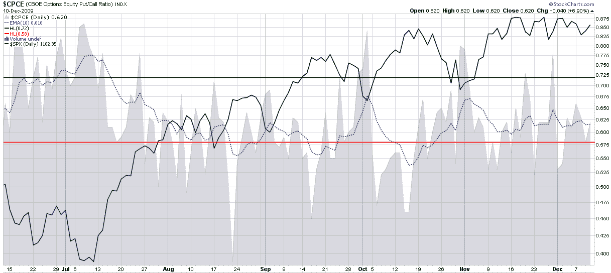

<!--yml

分类：未分类

日期：2024-05-18 17:20:23

-->

# 股本看跌/看涨比率与下跌概率

> 来源：[`vixandmore.blogspot.com/2009/12/put-to-call-ratio-and-probability-of.html#0001-01-01`](http://vixandmore.blogspot.com/2009/12/put-to-call-ratio-and-probability-of.html#0001-01-01)

在过去的几天里，我回答了许多关于[看跌/看涨](http://vixandmore.blogspot.com/search/label/put%20to%20call)比率的问题。看来一些投资者担心，有经验的投资者正在秘密地进行大量看跌投注。不可避免地，这些担忧导致了对我在看跌/看涨比率中看到的内容的询问，以证实或否认这一点。

简要回顾，CBOE 发布了三个看跌/看涨比率。在我的首选图表网站 [StockCharts.com](http://stockcharts.com/) 中，这些被称为：

+   [CPCE](http://vixandmore.blogspot.com/search/label/CPCE) – 股本看跌/看涨比率的股票代码

+   [CPCI](http://vixandmore.blogspot.com/search/label/CPCI) – 指数看跌/看涨比率股票代码

+   [CPC](http://vixandmore.blogspot.com/search/label/CPC) – 总股本+指数数据的股票代码

出于我过去讨论的原因，我更喜欢 CPCE 比率，并将其用作逆向信号。CPCI 数据的问题在于，指数期权的机构订单流动往往以大量块的形式出现，这可能会产生误导性的短期信号。

最近，然而，CPCE、CPCI 和 CPC 都有非常相似的图表。我下面附上了 CPCE 的六个月图表，它显示了看跌活动相对于看涨活动的异常波动并不大。实际上，我用来看平滑 CPCE 数据的 10 天 EMA 几乎在过去的一个月里都是平坦的，正如我在上次写关于看跌/看涨比率时，[股本看跌/看涨比率不指向修正](http://vixandmore.blogspot.com/2009/12/equity-put-to-call-ratio-not-pointing.html)一样，当时[迪拜](http://vixandmore.blogspot.com/search/label/Dubai)债务危机爆发时的情况。

更多关于相关主题的内容，读者们可以查阅：

**[source: StockCharts]*

****披露：*** *无***
