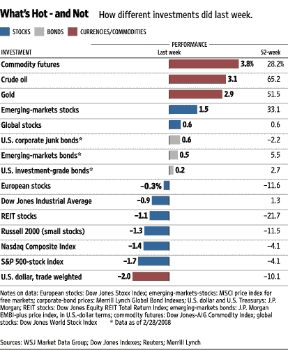

<!--yml

类别：未分类

日期：2024-05-18 18:42:05

-->

# VIX 和更多：看涨期权和看跌期权比 VIX、VWSI

> 来源：[`vixandmore.blogspot.com/2008/03/put-to-calls-and-trin-more-skittish.html#0001-01-01`](http://vixandmore.blogspot.com/2008/03/put-to-calls-and-trin-more-skittish.html#0001-01-01)

快速编程说明：从现在起，我在周末评论方面会更有自由发挥，使其不那么集中在 VIX 和 VWSI 上。最近 VIX 在市场动荡中最多是一个次要情节，而 VWSI 没有产生任何极端读数，因此我将扩大我的周范围，包括一些我最喜欢的其他指标：看涨期权和看跌期权比率、市场广度数据、TRIN 数字等。或者无论其他看起来最有新闻价值的东西。

《华尔街日报》“什么热门，什么不热门”的图表显示了上周的市场动作——这个故事开始变得熟悉了。上周，石油、黄金和其他大宗商品是最大的输家，而美元疲软和

美国

股市下跌是最大的输家。

本周 VIX 上涨了 2.48 (+10.3%)至 26.54，其中

[VWSI](http://vixandmore.blogspot.com/search/label/VWSI)

重新回到了零。更有趣的是看涨期权和看跌期权数据的行动，在那里

[ISEE](http://vixandmore.blogspot.com/search/label/ISEE)

从周二到周五每天都创下了 20 日、50 日和 100 日移动平均线的史上最低纪录，并且

[CPCE](http://vixandmore.blogspot.com/search/label/CPCE)

(CBOE 股票看涨/看跌比率)达到了新的高点 1.50\。在周五急剧下跌之后，

[TRIN](http://vixandmore.blogspot.com/search/label/TRIN)

和

[纳斯达克 TRIN](http://vixandmore.blogspot.com/search/label/TRINQ)

也分别结束了本周的极端读数 2.46 和 2.76。

所有这些都意味着两件事之一：要么市场极度超卖，焦虑的投资者将创造一个巨大的担忧之墙，为一次美好的反弹...或者我们正处在大多数投资者有生之年未曾见过的金融危机中。我继续呆在前者的阵营，但正在关注 SPX 1310 和 NDX 1725，以寻找堤坝进一步裂缝的迹象。
