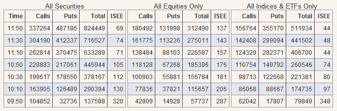

<!--yml

分类：未分类

日期：2024-05-18 18:25:42

-->

# VIX 和更多：看跌期权而非做空？

> 来源：[`vixandmore.blogspot.com/2008/09/puts-instead-of-shorts.html#0001-01-01`](http://vixandmore.blogspot.com/2008/09/puts-instead-of-shorts.html#0001-01-01)

下表展示了今天交易前两小时内[国际证券交易所](http://www.ise.com/)（[ISE](http://vixandmore.blogspot.com/search/label/ISE)）的看涨期权和看跌期权的活动情况。请注意，ISEE 是“看涨到看跌”比率，并非 CBOE 报告的“看跌到看涨”比率。

正如表格所反映的，一开始就出现了大量针对指数、ETF 和个股的看涨期权。注意到最后一小时左右，活动明显倾向于看跌期权一边，因为看涨到看跌比率大幅下降。在这些交易中很难区分对冲和投机，但现在随着期权价差似乎在缩小，隐含波动率急剧下降，我怀疑那些想要做空金融股及其他市场部分的人可能更倾向于购买看跌期权。

有趣的是观察新做空规定对期权市场的影响。

[来源：国际证券交易所]
