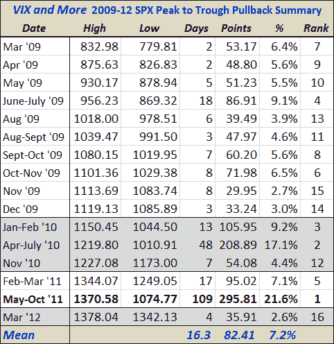

<!--yml

category: 未分类

date: 2024-05-18 16:36:48

-->

# VIX and More: 将当前 2.6%的 SPX 回调放入近期历史背景中

> 来源：[`vixandmore.blogspot.com/2012/03/putting-current-26-spx-pullback-in.html#0001-01-01`](http://vixandmore.blogspot.com/2012/03/putting-current-26-spx-pullback-in.html#0001-01-01)

自当前牛市开始以来——该市在恰好三年前今天触底于 666.79 点——我定期发布一个表格，记录自 2009 年 3 月低点以来标普 500 指数(S&P 500 index)最重要的回调。作为记录，当前四天 2.6%的跌幅几乎足以使其符合这 16 次回调之一。

下面的数据包含了日内读数，并使用从高点回调到最终低点的方法来计算回调的幅度和持续时间。

虽然表格中没有体现，但投资者可能需要牢记，过去三年中 median 回调持续了 7 个交易日，标普 500 指数(SPX)总计下跌了 5.6%。如果我们此次看到类似 median 回调形成，那么这可能意味着在非农报告发布后的某个周五，标普 500 指数(SPX)将触及约 1301 点的底部。

寻求更大数字的人可能会感兴趣地知道，平均回调会将标普 500 指数(SPX)带回 1275-1279 的范围，而与 2011 年 5 月至 10 月的回调相当的“回调”会将标普 500 指数(SPX)回调至约 1080 点。

*******

***披露(s):*** *无*
