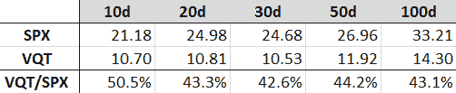

<!--yml

类别：未分类

日期：2024-05-18 16:45:11

-->

# VIX 和更多：问答：VQT 的历史波动性

> 来源：[`vixandmore.blogspot.com/2011/12/q-the-historical-volatility-of-vqt.html#0001-01-01`](http://vixandmore.blogspot.com/2011/12/q-the-historical-volatility-of-vqt.html#0001-01-01)

读者的提问是我了解投资者在波动率方面最困惑和担忧的方面之一，因此我在 2012 年要努力做的一件事就是更多地整理以前帖子评论区中可能被埋没的 Q&A 交流，并在这里揭示它们。

当我在[VIX 交易所交易产品：2011 年回顾](http://vixandmore.blogspot.com/2011/12/vix-exchange-traded-products-year-in.html)中偶然发现以下评论时，我想起了 Q&A 的重要性，我担心这个评论可能已经在假期混乱中被遗忘了。【记录在案，我为那篇帖子贴上了我神秘的“[名人堂](http://vixandmore.blogspot.com/search/label/hall%20of%20fame)”标签，我通常只用它来每年表彰少数几篇帖子。】

以下是一条评论/问题：

> 感谢您提醒我注意 VQT。在哪里可以找到其实际波动率数字...或者这个数字就是 VIX？

在深入讨论 VQT 的实现或【历史波动率】（这两个术语是同义的）之前，我必须指出这个问题暗示了一些对实现波动率和 VIX 之间的混淆。

首先，实现波动率也被称为历史波动率，因为它基于过去的价格变动，已经观察到，并且可以非常精确地计算（更多详情请参见[计算中心化和非中心化历史波动率](http://vixandmore.blogspot.com/2009/12/calculating-centered-and-non-centered.html)）这基本上是一个投资者通过后视镜看到的东西。

【隐含波动率】（http://vixandmore.blogspot.com/search/label/implied%20volatility）与它的实现/历史波动率亲戚大不相同。它归结于市场对投资者目前为期权支付的价格所做出的对未来（历史）波动率的最好猜测。VIX 是隐含波动率的一个特定实例，基于未来 30 天内标普 500 指数的期权计算得出。用汽车比喻来说，它就像是司机共识认为下一个弯道和地平线处会有的波动率。

回到 VQT 的话题，下面的图表捕捉了基于 VQT 过去每日价格变动的历史波动率，回顾期为 10 天、20 天、30 天、50 天和 100 天。由于这些是基于价格变动计算的，它们必然是基于交易日而非日历日，这是隐含波动率数据所使用的时间单位。

查看表格，VQT 过去 30 个交易日的历史波动率数字在 10.50 - 10.90 范围内。100 天回顾窗口带我们回到今年初的八月，因此 100 天的历史波动率更高，达到 14.30 并不令人意外。

我还包含了一些标准普尔 500 指数（SPX）的历史波动率数据，用于比较目的。请注意，在相同的回顾期内，SPX 的历史波动率比 VQT 高出 100 - 130%。

可以在专注于期权交易的经纪人网站（optionsXpress、TradeMonster、Trade King、thinkorswim/TD Ameritrade 等）或期权数据提供商如 Livevol 和 iVolatility 找到历史波动率数据。

相关文章：

****

**披露声明：**

*optionsXpress、TradeMonster、Trade King 和 Livevol 是 VIX and More 的广告商*
