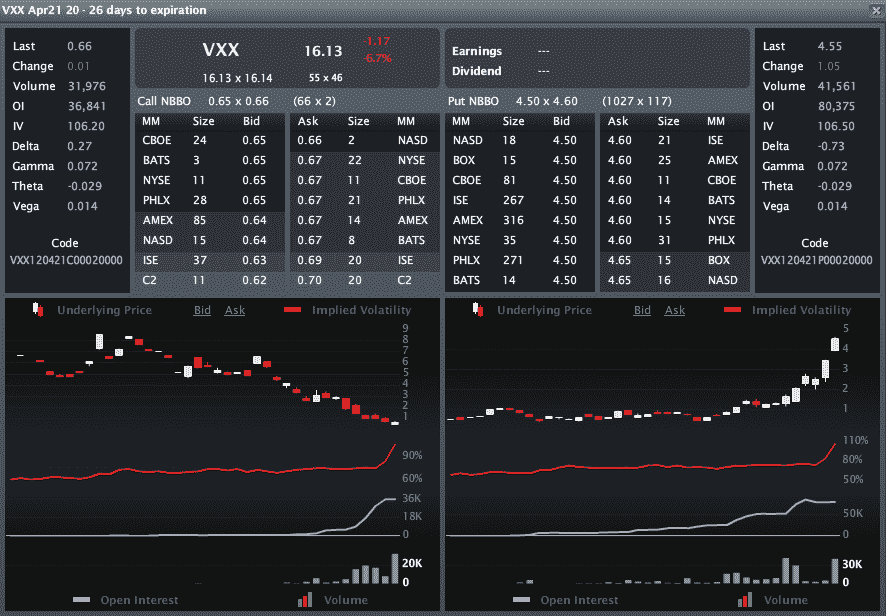

<!--yml

类别：未分类

日期：2024-05-18 16:35:07

-->

# VIX 和更多：问答：VXX 下跌，但 4 月 20 日看涨期权上涨

> 来源：[`vixandmore.blogspot.com/2012/03/q-vxx-declines-yet-april-20-calls-rise.html#0001-01-01`](http://vixandmore.blogspot.com/2012/03/q-vxx-declines-yet-april-20-calls-rise.html#0001-01-01)

一位读者今天早些时候问道：

> 你能向新手解释为什么[VXX](http://vixandmore.blogspot.com/search/label/VXX)今天下跌了 1.05 点，而 4 月 20 日的看涨期权却上涨了 0.05 点吗？*

**这是一个很好的问题，我以某种形式经常收到。

虽然影响期权价格的因素有很多，但在短期内对期权价格变化影响最大的通常是：

1) 标的资产价格的变化

2) 期权的隐含波动率的变化

既然我们知道从问题中得知 VXX 今天下跌（并且从问题提出的时间以来跌幅更大），这几乎可以肯定是指隐含波动率是罪魁祸首。

与其猜测，我找到了下面这张来自[LivevolPro](http://livevolpro.com/)的图表，证实了在 VXX 的 4 月 20 日看涨期权的情况下，隐含波动率（IV），如图表中的实红线所示（左边的 VXX 4 月 20 日看涨期权，右边的 4 月 20 日看跌期权），从周五的 84 跃升至今天的 106 以上。为了有些历史背景，在周五之前的一个月里，IV 一直卡在 70 年代，此时从 75 增加到 84。

这对于那些相对新手来说应该是一个提醒，他们被方向性交易可能赚取大量资金的潜力所吸引。猜测价格变动的方向不足以进行盈利的方向性交易。除了猜对方向外，期权交易者还必须注意隐含波动率的变化以及[时间衰减](http://vixandmore.blogspot.com/search/label/time%20decay)，又名[theta](http://vixandmore.blogspot.com/search/label/theta)的影响。

对于不熟悉期权定价模型具体细节的人来说，维基百科上的[Black-Scholes 公式](http://en.wikipedia.org/wiki/Black%E2%80%93Scholes)是一个很好的起点。

相关文章：

*来源：[LivevolPro.com]*

***免责声明(s):*** 在撰写本文时持有 VXX 的空头仓位；Livevol 是 VIX 和 More 的广告商
