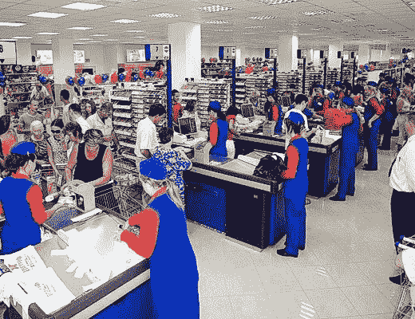

<!--yml

分类：未分类

日期：2024-05-18 18:30:04

-->

# VIX 和更多：排队理论与油价

> 来源：[`vixandmore.blogspot.com/2008/08/queuing-theory-and-price-of-oil.html#0001-01-01`](http://vixandmore.blogspot.com/2008/08/queuing-theory-and-price-of-oil.html#0001-01-01)

我本以为今天早上可能会写些具有挑衅性和不同寻常的东西，然而我感到惊讶——且高兴地看到， Kurt Cobb 在 Resource Insights 博客上比我早几天提出了相同的观点。在周日的[排队理论能解释油价的剧烈波动吗？](http://resourceinsights.blogspot.com/2008/08/does-queueing-theory-explain-oils-wild.html)一文中，Cobb 利用排队理论作为可能解释，这些波动似乎与供需的变化不成比例。

我要说的是，我对[排队理论](http://en.wikipedia.org/wiki/Queueing_theory)的了解非常有限，仅限于商学院期间对这一主题的简要了解。尽管如此，那次接触给我留下了深刻的印象，因为其中一个重要的收获就是，一个非常小且看似微不足道的变化可以迅速使系统从平衡状态变为混乱状态。

想象一个有十个收银员的杂货店，每个收银台前只有一个人或两个人。如果一个收银员休息了 10 分钟，你不会期望其他九个队伍会在几分钟内翻三倍或四倍，但根据排队理论，这种情况很可能会发生。同样，如果顾客以每 15 秒一个人的速度进入商店，那么从每 14 秒进一个顾客的变化来看，你不会认为在 10 分钟的休息结束前，队伍会从两个人深变成十个人深，但再一次，这又是一个可能的情景。

排队理论的数学（我并不想深入了解）解释了如何在边际上非常小的变化（例如，收银员数量、平均结账时间、顾客到达率等）可以使系统迅速从平衡状态变为瓶颈状态，从而导致等待时间呈指数级增加。说一家杂货店与世界石油市场相当可能有些牵强，但我确实认为排队理论提供了一个模型，说明了输入和输出率的小变化如何在很短的时间内造成巨大的瓶颈问题。
