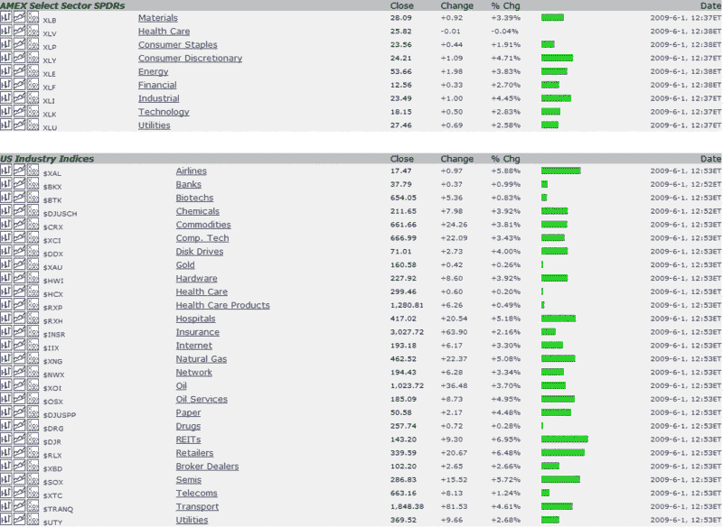

<!--yml

category: 未分类

date: 2024-05-18 17:45:11

-->

# VIX 和更多：房地产投资信托和零售商领涨今日市场

> 来源：[`vixandmore.blogspot.com/2009/06/reits-and-retailers-leading-todays.html#0001-01-01`](http://vixandmore.blogspot.com/2009/06/reits-and-retailers-leading-todays.html#0001-01-01)

下面是我从优秀的[StockCharts 市场概览](http://stockcharts.com/charts/summary/)页面中摘录的一段，该页面提供了一幅包括多种指数、[板块](http://vixandmore.blogspot.com/search/label/sectors)、地理区域和资产类别的图形和数值概览。

今天我将关注那些领涨市场的板块。这些板块包括房地产投资信托（REITs）和零售商，还有交通行业的支持，包括航空公司。坦白说，目前板块的整体弱势非常小，只是力量的强弱不同。虽然下图没有显示，但今天的日元（[日元](http://vixandmore.blogspot.com/search/label/Yen)）表现也很好。

我对今天市场的反弹能否持续持有一定的怀疑态度，但只要反弹的广度持续，概率上来看，出现反转的概率并不高。

*[来源：StockCharts]*
