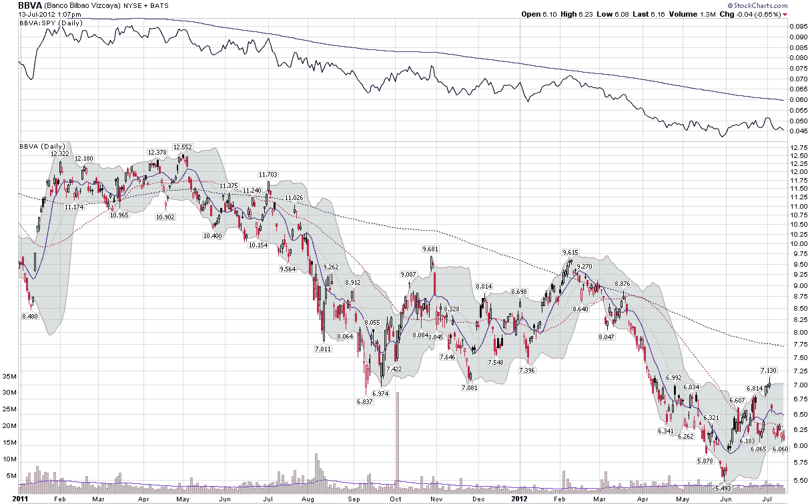

<!--yml

分类：未分类

日期：2024-05-18 16:26:20

-->

# VIX 和更多：反弹让西班牙银行落后

> 来源：[`vixandmore.blogspot.com/2012/07/rally-leaves-spanish-banks-behind.html#0001-01-01`](http://vixandmore.blogspot.com/2012/07/rally-leaves-spanish-banks-behind.html#0001-01-01)

今天，股市全线上涨，标普 500 指数上涨超过 1.4%，大多数热力图显示的都是不同深浅的绿色。即使是欧洲股市今天也很强劲。由于欧洲交易所周末休市，欧洲国家 ETF 跟随美国市场上涨，尽管[西班牙](http://vixandmore.blogspot.com/search/label/Spain)的 ETF ([EWP](http://vixandmore.blogspot.com/search/label/EWP)) 一直表现不佳。

然而，看看西班牙银行的 ADRs，就会发现银行并没有参与今天的反弹。西班牙最大的银行，桑坦德银行（股票代码[SAN](http://vixandmore.blogspot.com/search/label/SAN)，一个月前今天是[STD](http://vixandmore.blogspot.com/search/label/STD)）今天仅实现了 0.03 的涨幅，而该国第二大银行，毕尔巴鄂比斯开亚银行（股票代码[BBVA](http://vixandmore.blogspot.com/search/label/BBVA)）则下跌了 0.04。

简而言之，无论美国市场如何表现，欧元区领导人说什么或做什么，这些西班牙银行的股票表现得就像它们穿着铅鞋在游泳一样。

下面的图表显示了自 2011 年初以来 BBVA 的股价走势，以及主要图表上的一项研究，该研究跟踪了同一时期 BBVA 相对于 SPY 的表现。在比率图表研究中，我添加了 BBVA:SPY 的 200 天移动平均线（实蓝线），以强调趋势一直向下，而且在过去 1 年半的任何时间点，比率都没有接近于交易在其 200 天移动平均线之上。

记录一下，SAN 和 SAN:SPY 比率图表同样难看，EWP:SPY 的类似图表也不比西班牙银行的好。

西班牙及其银行的情况如何解决，还有待观察。但在有解决办法的希望之前，我预计我们还会看到 SAN 和 BBVA 的看跌期权上有相当大的活动。

相关文章：

*[来源(s): StockCharts.com]*

***披露(s):*** *在撰写本文时做空 SAN 和 BBVA*
