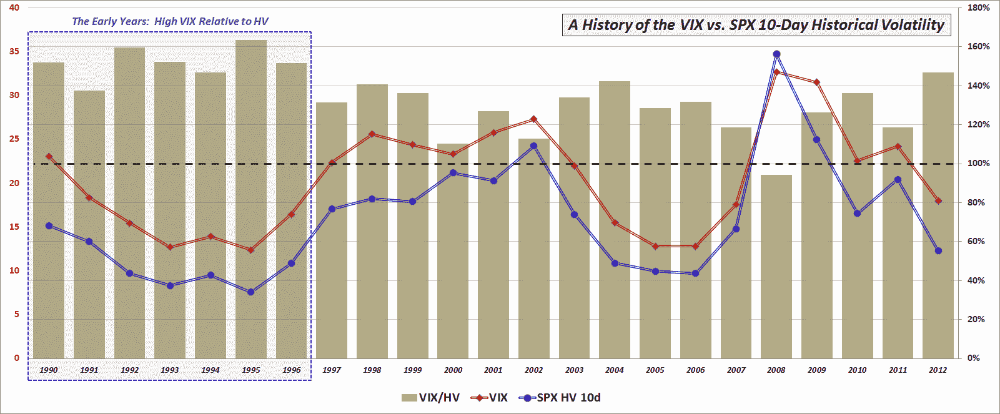

<!--yml

分类: 未分类

日期：2024-05-18 16:24:45

-->

# VIX and More: **VIX 到实现波动性的比率** 自 1996 年以来最高

> 来源：[`vixandmore.blogspot.com/2012/10/ratio-of-vix-to-realized-volatility.html#0001-01-01`](http://vixandmore.blogspot.com/2012/10/ratio-of-vix-to-realized-volatility.html#0001-01-01)

在我开始一系列关于[VIX 期货](http://vixandmore.blogspot.com/search/label/VIX%20futures)的帖子之前，我认为重要的是先加一些背景，以一些关于 VIX 与标准普尔 500 指数的[历史波动性](http://vixandmore.blogspot.com/search/label/historical%20volatility) (HV) 关系的观察的形式。在没有任何关于未来的信息的情况下，事实证明，历史波动性（又称为[实现波动性](http://vixandmore.blogspot.com/search/label/realized%20volatility)或统计波动性）可以提供一个相当准确的未来波动性测量。事实上，很难想象地通过将来的信息来提出比仅仅从最近的实现波动性推断出的未来波动性更好的估计。

通过查看历史数据，可以看出，VIX 已经有超过估计未来实现波动性的历史。事实上，在 VIX 历史数据的 23 年中，只有一年—2008 年—实现波动性高于 VIX 预测的情况。

如下图所示，早期交易员养成了大幅高估未来波动性的习惯。例如，从 1990 年至 1996 年，VIX 对实现波动性的过度估计平均高达 49%。自 1997 年以来，这种过度估计的幅度已经大幅下降，约为 24%，因为投资者显然开始意识到他们过度支付了特别是投资组合保护和期权的费用。

*[资料来源：芝加哥期权交易所 (CBOE)，雅虎 (Yahoo)]*

说到这里，2012 年是一个异常实例，VIX 高估了 SPX 的 10 日历史波动性达 47%——自 1996 年以来最大的缓冲垫。不出所料，低实际波动性往往会压抑 VIX 以及 VIX 期货期限结构的前端。因此，2012 年迄今为止平均 10 日历史波动性异常低至 12.25 可以在一定程度上解释 VIX 期货期限结构的陡峭（极端[正向市场](http://vixandmore.blogspot.com/search/label/contango)）。然而，考虑到 2004-2007 年期间甚至更低波动性数字，2012 年的低历史波动性最多只能算是一个很小的一部分解释。VIX 期货期限结构陡峭的两个更好潜在解释是 2008 年金融危机及其后果的心理（即[灾难印记](http://vixandmore.blogspot.com/search/label/disaster%20imprinting)，[可用性偏见](http://vixandmore.blogspot.com/search/label/availability%20bias)，近期效应等）以及由于地缘政治和宏观经济悬而未决问题，未来更高波动性的预期，这比更多无事件的经济时期对未来前景的担忧要高得多。当然，VIX 交易所交易产品激增增长对 VIX 期货期限结构的影响也是一个问题。

在我更详细地讨论这些问题之前，下一个篇章将讨论 VIX 期货期限结构的演变。

相关文章：

**披露：** *无*
