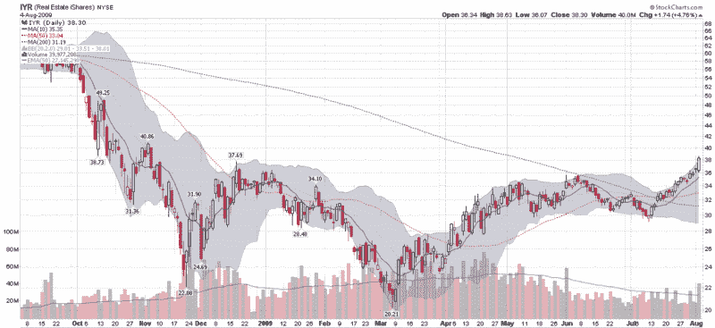

<!--yml

类别：未分类

日期：2024-05-18 17:35:22

-->

# VIX and More: 房地产突破而主要指数暂停

> 来源：[`vixandmore.blogspot.com/2009/08/real-estate-breaks-out-while-major.html#0001-01-01`](http://vixandmore.blogspot.com/2009/08/real-estate-breaks-out-while-major.html#0001-01-01)

在过去十分钟内的买入波浪推动主要指数今天小幅上涨，此前一天交易清淡。在 6 月份待售房屋销售增长 3.6%的消息公布后，市场早盘股票受到提振。尽管大盘指数全天在 unchanged 附近波动，但[房地产](http://vixandmore.blogspot.com/search/label/real%20estate)板块一整天都表现强劲，[IYR](http://vixandmore.blogspot.com/search/label/IYR)，这个广受欢迎的房地产 ETF，当日上涨了 4.8%。

下图显示，今天的行动构成了 IYR 的突破，目前交易在自 11 月初以来的水平。今天 4000 万股的成交量也是过去两个月最高的。

三个子行业的房地产 ETF 的表现甚至比 IYR 还要出色。FTSE NAREIT 零售精选指数基金[RTL](http://vixandmore.blogspot.com/search/label/RTL)上涨了 6.0%，而 FTSE NAREIT 工业/办公室精选指数基金[FIO](http://vixandmore.blogspot.com/search/label/FIO)上涨了 5.5%，FTSE NAREIT 住宅精选加指数基金[REZ](http://vixandmore.blogspot.com/search/label/REZ)也增加了 4.9%。关于这三个 ETF 的持仓情况，请查看[三个值得关注的商业房地产子行业](http://vixandmore.blogspot.com/2009/04/three-commercial-real-estate-sub-sector.html)。

*[source: StockCharts]*
