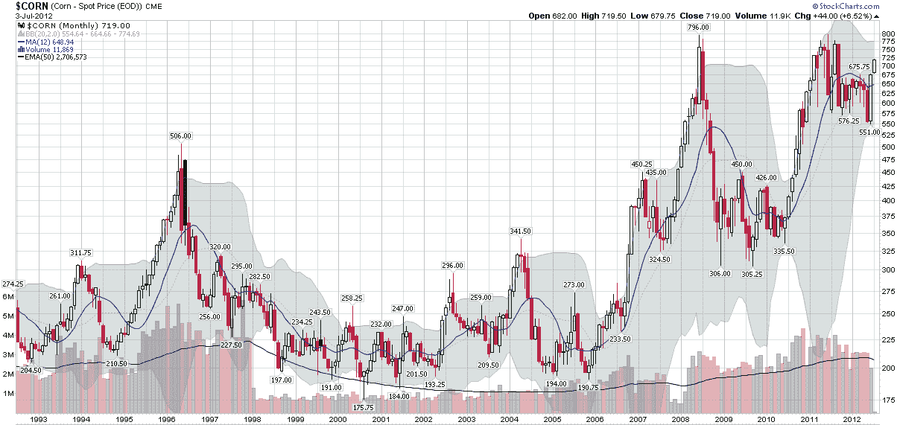

<!--yml

类别：未分类

date: 2024-05-18 16:26:56

-->

# VIX and More: 近期玉米反弹在 20 年玉米期货价格背景下的分析

> 来源：[`vixandmore.blogspot.com/2012/07/recent-corn-rally-in-context-of-twenty.html#0001-01-01`](http://vixandmore.blogspot.com/2012/07/recent-corn-rally-in-context-of-twenty.html#0001-01-01)

自 2010 年 6 月 Teucrium Commodity Trust 玉米基金 ETF（[CORN](http://vixandmore.blogspot.com/search/label/CORN)）推出以来，那些不愿意开设期货账户的投资者现在可以通过 CORN ETF 来持有玉米的多头和空头头寸，该 ETF 持有一篮子玉米期货。

对于刚刚接触玉米或[商品](http://vixandmore.blogspot.com/search/label/commodities)的新投资者来说，CORN 的大幅上涨可能让他们感到惊讶，CORN 在过去两周内上涨了 20%，在过去一个月内上涨了 28%。他们可能认为 CORN（以及玉米期货）的上涨很可能很快就会耗尽。

虽然 CORN/玉米可能确实即将触顶，但我敦促新进入商品市场的投资者研究过去几年农产品价格的历史，并注意在异常天气模式参与下，极端价格波动并不少见。下面的图表使用了过去 20 年玉米期货的月度柱状图。请注意，尽管 2012 年 6 月至 7 月的玉米移动看起来很令人印象深刻，但它与 1994-1996 年、2005-2008 年和 2010-2011 年发生的玉米价格高峰相比就相形见绌了。换句话说，这可能是玉米价格巨大变动的开始，特别是考虑到过去一个月左右的 price move 是在一个更高的基础上发生的。

玉米可能很快就会触顶，但并不意味着肥胖的尾部波动一定会在前高每蒲式耳 8.00 美元处结束。

顺便说一下，如果你打算交易 CORN 或玉米期货，成为一个天气大师当然会有帮助，但请注意，理解影响玉米价格的天气细微差别并非易事。

相关文章：

数据来源：[StockCharts.com]

***披露：*** *在撰写本文时持有 CORN*
