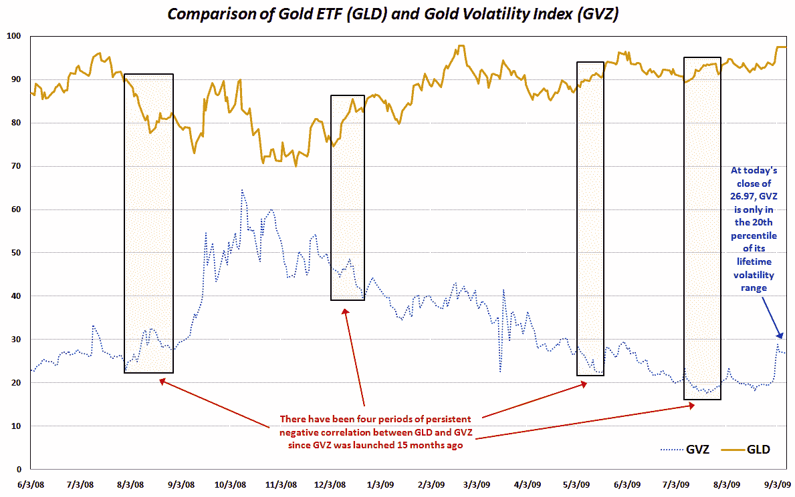

<!--yml

分类：未分类

日期：2024-05-18 17:30:31

-->

# VIX 和更多：黄金和黄金波动性的最新发展

> 来源：[`vixandmore.blogspot.com/2009/09/recent-developments-in-gold-and-gold.html#0001-01-01`](http://vixandmore.blogspot.com/2009/09/recent-developments-in-gold-and-gold.html#0001-01-01)

今天金价首次突破每盎司 1000 美元大关，与此同时，关于黄金价格及其波动性的讨论也颇多。【黄金价格](http://vixandmore.blogspot.com/search/label/gold)

虽然没有人争议黄金价格很高（今天它们也达到了 52 周的高点），但我所看到的关于黄金波动性居高不下的评论并没有得到数据的支撑。事实上，今天 CBOE 的黄金波动率指数（[GVZ](http://vixandmore.blogspot.com/search/label/GVZ)），也被称为“黄金 VIX”，收盘价为 26.97，仅处于指数自 2008 年 6 月推出以来的第 20 个百分位。这意味着黄金 ETF（[GLD](http://vixandmore.blogspot.com/search/label/GLD)）的隐含波动率并没有预计在未来几个月内商品会有大动作。

回顾历史波动率，数据显示波动率正处于历史低点。例如，一周前的今天，GLD 创下了 20 日历史波动率的新低纪录。尽管在过去一周内历史波动率略有上升，但它仍然只处于自 2008 年 6 月以来的 HV 数据的第 6 个百分位。

相关但讨论较少的现象是黄金与黄金波动率之间的相关性。我用几种不同的方式跟踪这个指标，包括使用 GLD 和 GVZ 之间的 10 天和 20 天滚动相关性。在过去的三天里，10 天和 20 天滚动相关性都创下了新纪录，表明最近 GLD 和 GVZ 几乎同步上涨，特别是在过去五个交易日内。

相关数据确实有一些有趣的历史先例。例如，上次 10 天滚动相关性创纪录是在 6 月初，就在黄金触及 990 下方的高点时。

在下面的图表中，我记录了 GLD 和 GVZ 自 GVZ 推出以来的走势。此外，我还突出了一些过去 GLD 和 GVZ 持续负相关的情况。

在不久的将来，我会深入探讨 GLD 和 GVZ 之间极端正相关性的主题。

读者可以查阅以下关于黄金和黄金波动性的额外文章：

