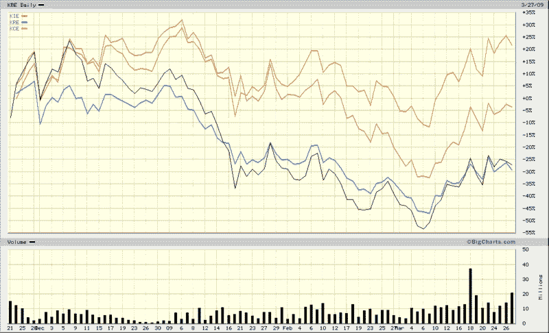

<!--yml

分类：未分类

日期：2024-05-18 17:53:44

-->

# VIX and More: 近期金融板块成分表现

> 来源：[`vixandmore.blogspot.com/2009/03/recent-financial-sector-component.html#0001-01-01`](http://vixandmore.blogspot.com/2009/03/recent-financial-sector-component.html#0001-01-01)

早在去年 12 月初，在[Breaking Down the Financial Sector Post-Lehman](http://vixandmore.blogspot.com/2008/12/breaking-down-financial-sector-post.html)一文中，我对比了广泛基于的 KBW 银行指数 ETF（简称[KBE](http://vixandmore.blogspot.com/search/label/KBE)）和其他几个 KBW 金融板块 ETF，特别是[KRE](http://finance.yahoo.com/q?s=KRE)（KBW 地区银行指数）、[KCE](http://finance.yahoo.com/q/pr?s=KCE)（KBW 资本市场指数）和[KIE](http://finance.yahoo.com/q/pr?s=KIE)（KBW 保险指数）。当时，地区银行指数的表现优于其姊妹指数，但已经开始显示出一些弱点。

快进四个月，下面的图表对比了自去年 11 月 21 日（SPX 741）低点以来，同一组 ETF 的表现，当时可能是金融板块看起来最黑暗的时刻。

请注意，现在资本市场组（前十大持仓包括[GS](http://vixandmore.blogspot.com/search/label/GS)、[MS](http://vixandmore.blogspot.com/search/label/MS)、[CME](http://vixandmore.blogspot.com/search/label/CME)、[SCHW](http://vixandmore.blogspot.com/search/label/SCHW)和[STT](http://vixandmore.blogspot.com/search/label/STT)）自这段时间的涨幅超过了 20%，而保险股几乎回到了盈亏平衡点，同时两个银行 ETF，地区和中心货币变种，一直在后面追赶，近期几乎步调一致，在这段时间内的亏损超过了 25%。所有四个组都从 3 月份的低点反弹得相当不错，但再次强调，是资本市场组表现出了最强的力量，州街银行（STT）走在前列。

*[来源：BigCharts]*
