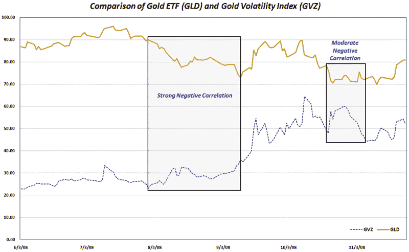

<!--yml

分类：未分类

日期：2024-05-18 18:14:02

-->

# 维基黄金波动性：最近黄金波动性

> 来源：[`vixandmore.blogspot.com/2008/11/recent-gold-volatility.html#0001-01-01`](http://vixandmore.blogspot.com/2008/11/recent-gold-volatility.html#0001-01-01)

最近我收到了很多关于[黄金](http://vixandmore.blogspot.com/search/label/gold)和黄金波动性的问题，因此随着媒体对黄金的关注度很高，我认为这是检查商品和 CBOE 的黄金波动性指数([GVZ](http://vixandmore.blogspot.com/search/label/GVZ))的好时机，该指数于八月推出。

如今，每个投资者都应该关注黄金，因为它反映了市场对短期通货紧缩风险和长期通货膨胀预期的波动。

在下面的图表中，我捕捉了由[GLD](http://vixandmore.blogspot.com/search/label/GLD)，这个广受欢迎的黄金 ETF 追踪的商品价格行动。我还包括了 GVZ（又名“黄金 VIX”）以衡量黄金交易中最近的一些波动性。黄金波动性在 10 月 10 日达到顶峰，并在过去的六周内逐渐下降。图表反映出黄金波动性的峰值通常与商品价格的峰值一致。

黄金价格与波动性之间的更广泛问题要复杂得多，且受到周期性波动的影响。在图表中，我突出了两个黄金和黄金波动性持续负相关的时期，先是八月，后来是十月中旬。这两个时期都对黄金价格不利，但当相关性恢复为正值时，黄金价格在这两个实例中都开始上升。

现在还为时尚早，无法对黄金价格和黄金波动性之间的任何确定性结论做出判断，但我会定期回到这个话题上，因为我对这个问题的看法在不断发展。

[来源：VIX and More]
