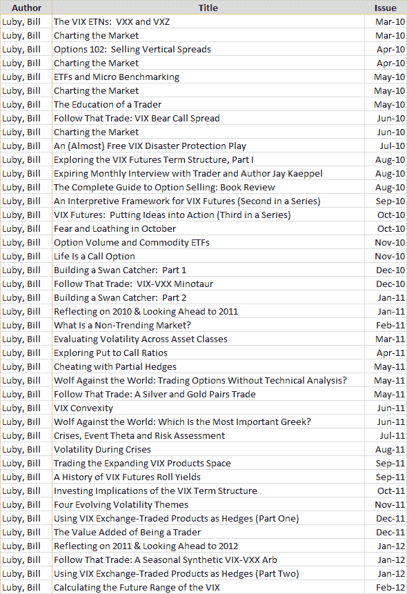

<!--yml

分类：未分类

日期：2024-05-18 16:37:19

-->

# VIX 和更多：近期研究项目与 Expiring Monthly

> 来源：[`vixandmore.blogspot.com/2012/03/recent-research-projects-and-expiring.html#0001-01-01`](http://vixandmore.blogspot.com/2012/03/recent-research-projects-and-expiring.html#0001-01-01)

在最近的一篇帖子[《VIX 和更多：五年的回顾》](http://vixandmore.blogspot.com/2012/01/five-years-of-vix-and-more.html)中，我突然想到我忽略提到了我对[《*Expiring Monthly: The Option Traders Journal*》](http://www.expiringmonthly.com/)的贡献，在那里我通常会以比在这里更长的形式（1000-4000 字）发表一些我专有的研究和分析。

与其像我通常那样展示目录截图并简要评论我最近在想什么以及为杂志写了什么，我想既然*Expiring Monthly*的第二年刚刚结束，列出我为杂志写的所有 42 篇文章的标题可能会让读者对我的更详细的研究兴趣有所了解。

因此，下面的图表列出了我为*Expiring Monthly*写的所有文章，按时间顺序排列，包括上周出版的 2012 年 2 月的*计算 VIX 的未来范围*。

我最近在这里重新发布了[《VIX-VXX 半人马贸易》](http://vixandmore.blogspot.com/2012/01/vix-vxx-minotaur-trade.html)，该文章首次出现在 2010 年 12 月的*Expiring Monthly*版本中。同样，在这里也重新发布了源自*Expiring Monthly*编辑末页栏目的[《交易者的教育》](http://vixandmore.blogspot.com/2010/09/education-of-trader.html)。今后，我想我会在这里挑选来自*[Expiring Monthly 档案](http://www.expiringmonthly.com/archives.html)*的额外文章（可能每年挑选 1-2 篇文章，至少已经发表一年），看看它们是否能在这里找到更广泛的读者群。鉴于最近对对冲的兴趣，像*用部分对冲作弊*这样的文章当然是有可能出现在这些页面上的。

有关以前问题的更多信息，可以通过在此文中跟随带有[Expiring Monthly 标签](http://vixandmore.blogspot.com/search/label/expiring%20monthly)的所有帖子找到。对于那些对订阅信息和杂志额外详情感兴趣的人，您可以在[`www.expiringmonthly.com/`](http://www.expiringmonthly.com/)找到所有相关信息。

相关帖子：

******

***免责声明：*** *在撰写本文时持有 VXX 的空头仓位；我是 Expiring Monthly 的创始人之一和所有者*
