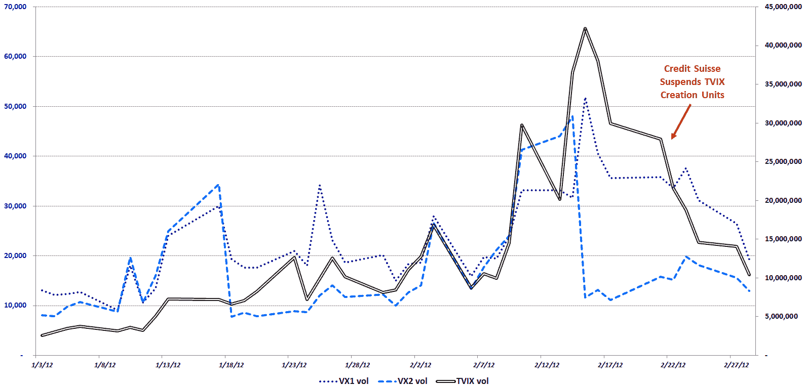

<!--yml

分类：未分类

日期：2024-05-18 16:37:40

-->

# 波动率指数（VIX）与更多内容：近期 TVIX 交易量和 VIX 期货交易量

> 来源：[`vixandmore.blogspot.com/2012/02/recent-tvix-volume-and-vix-futures.html#0001-01-01`](http://vixandmore.blogspot.com/2012/02/recent-tvix-volume-and-vix-futures.html#0001-01-01)

我设法让几天过去而没有提到突然变得炙手可热的 VelocityShares 每日 2 倍波动率短期交易所交易基金（TVIX）的话题，结果在昨晚旧金山的彭博波动率研讨会上发现，对于这个主题的信息需求似乎是永无止境的。尽管下面的链接应该提供了大部分关于 TVIX 关键问题的背景和上下文，但今天我将介绍一些与 2012 年第一个月和第二个月 TVIX 的交易量以及相应的一月和二月[VIX 期货](http://vixandmore.blogspot.com/search/label/VIX%20futures)的交易量相关的额外信息。下面的图表在右侧 Y 轴上绘制了 TVIX 的每日成交量（实心黑色线条），在左侧 Y 轴上绘制了来自 CBOE 期货交易所（CFE）的结算价格的前两个月 VIX 期货的成交量。

再次让图表来说明大部分情况，但很明显，当瑞士信贷（Credit Suisse，[CS](http://vixandmore.blogspot.com/search/label/CS)）在 2 月 21 日交易日结束后宣布暂停 TVIX 的新创造单位时，TVIX 以及前端（虚线深蓝色线条）和第二个月（虚线中蓝色线条）的成交量都急剧下降，几乎同步进行。

要想让 VIX 期货及相关市场达到瑞士信贷愿意重新开放 TVIX 创造单位窗口的程度，还需要看到，但至少现在，VIX 期货市场的“新常态”以及 TVIX 的某些方面开始类似于两个月前的“旧常态”。

相关文章：

来源（s）：CBOE 期货交易所，雅虎

***披露（s）：*** *在撰写本文时持有 TVIX 空头仓位*
