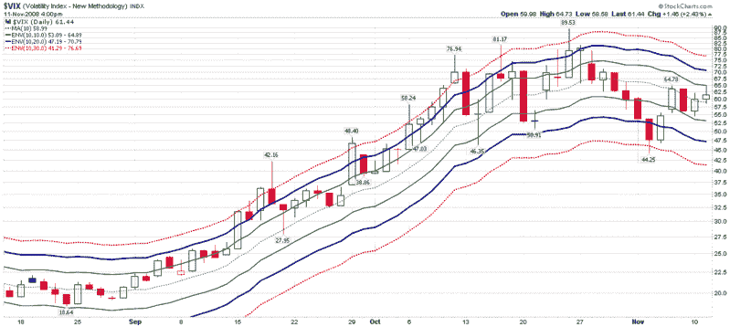

<!--yml

分类：未分类

日期：2024-05-18 18:16:48

-->

# VIX 和更多：在移动平均线范围内解读近期 VIX 活动

> 来源：[`vixandmore.blogspot.com/2008/11/recent-vix-activity-in-context-of.html#0001-01-01`](http://vixandmore.blogspot.com/2008/11/recent-vix-activity-in-context-of.html#0001-01-01)

最近我收到了很多关于 VIX 的问题。这些问题通常是关于“它要去哪里？”或“它意味着什么？”的，但也有一些来自想要知道如何最佳绘制 VIX 的 DIY 人群。

虽然在这个空间里可能并不总是看起来是这样，但我是一个大力倡导保持简单的人。下面的图表是思考 VIX 的一种简单方法。该图表利用了三种不同的[移动平均线](http://vixandmore.blogspot.com/search/label/moving%20average%20envelopes)来跟踪 VIX 与其[10 天简单移动平均线](http://vixandmore.blogspot.com/search/label/10%20day%20SMA)的关系。与[布林带](http://vixandmore.blogspot.com/search/label/Bollinger%20bands)不同，后者根据最近的波动趋势扩张和收缩，移动平均线定义了从移动平均线的固定百分比偏差。在下面的图表中，中间的虚线绿色线条是 10 天 SMA，实线绿色线条代表 10%的移动平均线，粗体深蓝色线条表示 20%的移动平均线，虚线红色线条是在 10 天 SMA 上下的 30%。

在解释方面，考虑 VIX 在其大部分时间里都在 10%的移动平均线范围内（例如，8 月底，最近几天），并且通常只在短暂的离开 20%的移动平均线范围之前被均值回归拉回。当然，波动性最近的历史高点使得 VIX 在 9 月和 10 月的几乎所有时间都超过了 20%的移动平均线顶部，然后在上周戏剧性地逆转到 20%的移动平均线以下。除了最近的市场活动外，30%的移动平均线是多余的。历史上，这些每年大约被突破一次，而且几乎总是在 VIX 激增时。

[来源：StockCharts]
