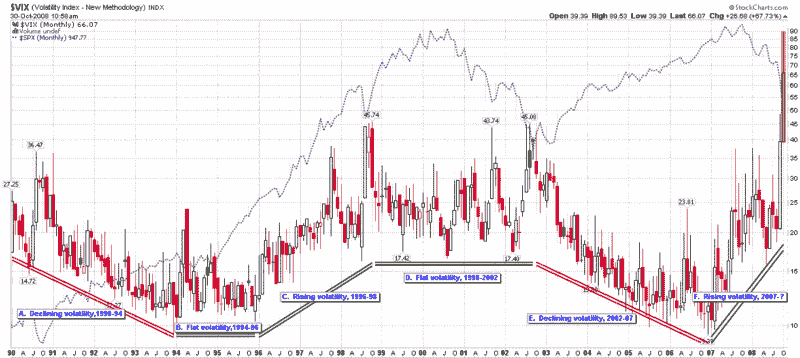

<!--yml

category: 未分类

date: 2024-05-18 18:18:09

-->

# VIX 和更多：最近的波动性和 VIX 宏观周期

> 来源：[`vixandmore.blogspot.com/2008/10/recent-volatility-and-vix-macro-cycles.html#0001-01-01`](http://vixandmore.blogspot.com/2008/10/recent-volatility-and-vix-macro-cycles.html#0001-01-01)

对波动率进行**科学**艺术式的[预测](http://vixandmore.blogspot.com/search/label/volatility%20forecast)，超过几周的时间，总是让我觉得更像占星术而非天文学，因此我带着一些不安的心情更新了我的[VIX 宏观周期](http://vixandmore.blogspot.com/search/label/VIX%20macro%20cycles)图表，看看在这个领域的前几篇博文对 2008 年有什么预测。

好消息是，在 2007 年 12 月，在[2007 年是波动性新纪元的开始吗？](http://vixandmore.blogspot.com/2007/12/was-2007-beginning-of-new-era-in.html)一文中，我至少成功地指出了近期趋势的持续性，写道：“当前波动性的上升应持续到整个 2008 年，即使波动性的上升速度开始放缓。”在一个看起来更安全的预测中，我说，“2007 年波动率的变化率是难以持续的——至少与以前周期中的波动率宏观周期斜率不一致。”如下图所示，从 2007 年 7 月至 2008 年 8 月，VIX 基本上呈横盘至下跌走势，此时近期波动性开始加剧。

我最近一次的[VIX 宏观周期更新](http://vixandmore.blogspot.com/2008/03/vix-macro-cycle-update.html)来自 2008 年 3 月 19 日，就在[贝尔斯登](http://vixandmore.blogspot.com/search/label/BSC)被[摩根大通](http://vixandmore.blogspot.com/search/label/JPM)收购的三天后。当时许多人认为波动性似乎低估了金融动荡的严重性。为了历史背景，我将重复当时的评估：

> **我仍然预计波动性将在 2008 年的大部分时间里维持在 22-26 的区间。观察当前的[VIX 期货](http://vixandmore.blogspot.com/search/label/VIX%20futures)报价，其中 5 月至 12 月的期货交易价格都低于 26，看来我的预测可能是市场共识的低端。**
> 
> **我最大的疑问是关于当前 VIX 宏观周期的持续时间——当然还有波动率继续上升的斜率。如果波动率上升的当前斜率保持不变，且最小周期时间为两年，那么到年底，VIX 可能会维持在约 40 的水平。我不认为会出现这种情况，但有趣的是，看看始于大约 15 个月前的波动率上升何时会消退。**

**所以……7 个半月后我可以说是我的预测在中秋节前后还站得住脚，但是当[雷曼兄弟](http://vixandmore.blogspot.com/search/label/LEH)申请破产时，[LEHVIX](http://vixandmore.blogspot.com/2008/06/lehvix.html)和 VIX 暴增，我的预测随之破灭。

从宏观周期角度来看，现在需要问的两个问题是当前波动性上升周期应该持续多久，以及下一个周期将走向何方。根据历史上 2-4 年的周期规律，考虑到最近 22 个月波动性上升的陡峭轨迹，我怀疑当前周期即将结束，要么在本周初已经达到顶峰，要么在接下来的两月内还将有一次最后的顶峰走势。

下一个走势的方向是更大的问题，也是更难回答的问题。前三次波动性的变化中有两次以多年的横向走势结束。鉴于当前经济面临的一些结构和基本挑战，更容易做出的预测似乎是未来几年波动性将保持高位。

然而，我要冒险坚持我的[恐惧泡沫](http://vixandmore.blogspot.com/2008/10/is-fear-bubble-bursting.html)理论，预测波动性在未来两年左右将逐渐减少。当 VIX 达到 70 时，不要受[锚定](http://en.wikipedia.org/wiki/Anchoring_and_adjustment)心理的影响。就在两个月前，VIX 还在十几的水平。虽然 VIX 可能还需要一段时间才能回到十几的水平，但我不会感到惊讶，如果 VIX 在另外 2-3 个月内回到 20 几的水平。

当然，前进道路的很大一部分将受到尚未上任的政府实施的政策和法规的强烈影响——所有这些都大幅增加了任何预测的不确定性。

来源：[StockCharts, VIX and More]**
