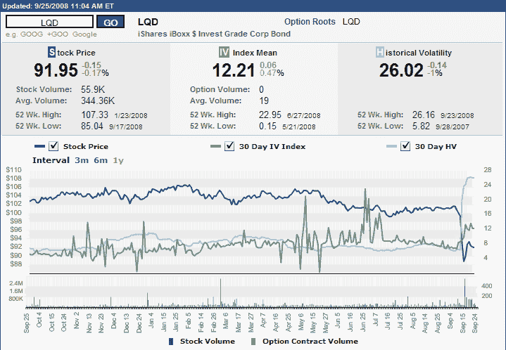

<!--yml

类别：未分类

日期：2024-05-18 18:24:52

-->

# VIX and More: Recent Volatility in Corporate Bonds

> 来源：[`vixandmore.blogspot.com/2008/09/recent-volatility-in-corporate-bonds.html#0001-01-01`](http://vixandmore.blogspot.com/2008/09/recent-volatility-in-corporate-bonds.html#0001-01-01)

很少会听到高波动率和债券在同一个句子中提及，这有一个很好的原因。这同样的原因也解释了为什么人们不会争论草地在星期四比星期三长得快，或者油漆是否比平时干得慢。大部分情况下，债券波动率是微波动率。

直到上周为止。

下图（来自[ISE](http://www.ise.com/)的 courtesy）展示了 iShares iBoxx $投资级企业债券 ETF ([LQD](http://finance.yahoo.com/q?s=lqd))的一年内定价、[隐含波动率](http://vixandmore.blogspot.com/search/label/implied%20volatility)和[历史波动率](http://vixandmore.blogspot.com/search/label/historical%20volatility)。仅从隐含波动率来看，人们可能会忍不住得出结论，3 月份相对平静，而债券市场的真正困难是从 5 月初到 7 月初。然而，ETF 的价格和历史的波动率却讲述了一个不同的故事。你很少会找到一个图表，在历史波动率剧增之前，隐含波动率并没有先上升，暗示即将发生的事情。

大幅波动的原因很大程度上是，除了信贷市场的一般冻结，几个月前 LQD 的一半持仓都在金融部门。只需查看[当前持仓](http://us.ishares.com/product_info/fund/holdings/LQD.htm)列表即可发现，LQD 继续持有雷曼兄弟和[AIG](http://finance.yahoo.com/q?s=aig)发行的债券，以及 Wachovia ([WB](http://finance.yahoo.com/q?s=wb)), 高盛([GS](http://finance.yahoo.com/q?s=gs)), 摩根士丹利([MS](http://finance.yahoo.com/q?s=ms))等最近受到极大压力的其他公司的债券。

根据你对美国经济的中长期看法，如果想要采取与保罗森等人提议的方法不太一样的投资策略，LQD 可能是一个有趣的买入并持有的投资选择。正如往常一样，买家需谨慎。

