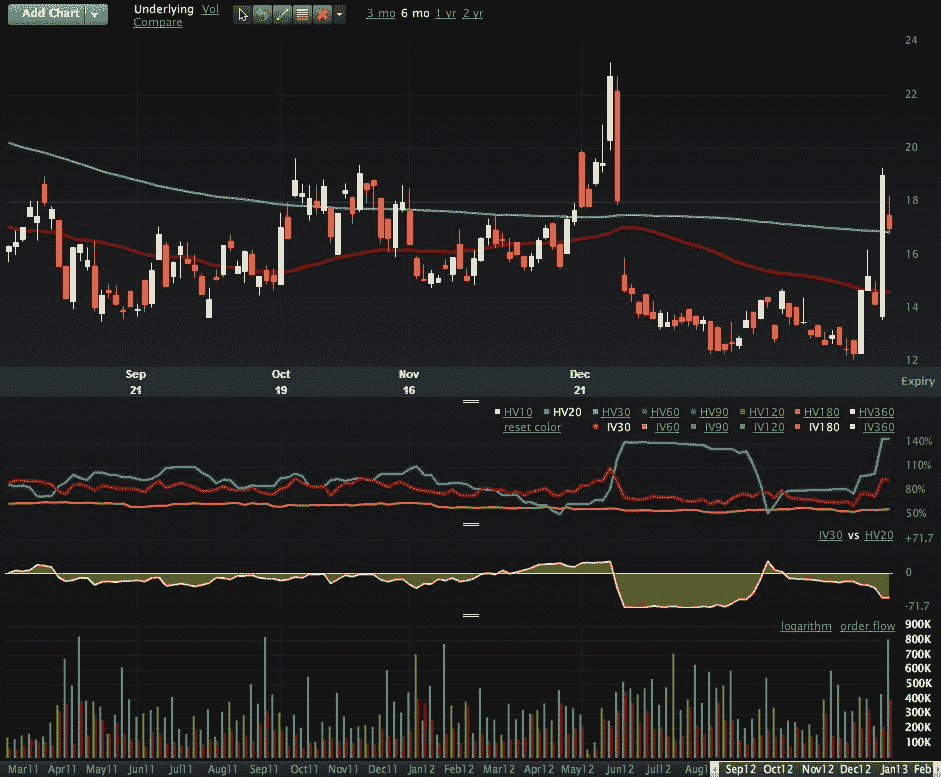

<!--yml

分类：未分类

日期：2024-05-18 16:18:13

-->

# VIX 和更多：创纪录的 VIX 期权交易量和大量购买 VIX 看涨期权

> 来源：[`vixandmore.blogspot.com/2013/02/record-vix-options-volume-and-large.html#0001-01-01`](http://vixandmore.blogspot.com/2013/02/record-vix-options-volume-and-large.html#0001-01-01)

在今天的交易时段还剩下大约半小时时，[VIX 期权](http://vixandmore.blogspot.com/search/label/VIX%20options)的购买量异常高——比昨天高得多。在我打下这些字的时候，已经有超过 855,000 份[VIX 看涨期权](http://vixandmore.blogspot.com/search/label/VIX%20calls)易手，今天很可能会创下自 2011 年 8 月市场恐慌以来 VIX 看涨期权交易量最高的记录。来自[LivevolPro](http://www.livevolpro.com/)的数据表明，VIX 看涨期权的 28%的交易是在委托价买入的，而 16%是在出价卖出的，这反映出购买 VIX 看涨期权的买家的价格敏感度不高，他们是这些交易背后的推动力。总的来说，已经成交了创纪录的 130 万股 VIX 期权合约，超过了 2012 年 9 月 11 日创下的 122 万股的旧记录。

请注意，尽管最近 VIX 的[隐含波动率](http://vixandmore.blogspot.com/search/label/implied%20volatility)有所上升，但按其目前水平来看，它正处于 2012 年的波动范围之中。

今天的股票市场可能看起来更加有序和稳定，但在期权市场上，却显示出日益增加的焦虑和担忧的迹象。

*[来源(s): LivevolPro.com]*

相关帖子：

****披露(s):*** *通过期权持有 VIX 的中性立场；Livevol 是 VIX 和 More 的广告商**
