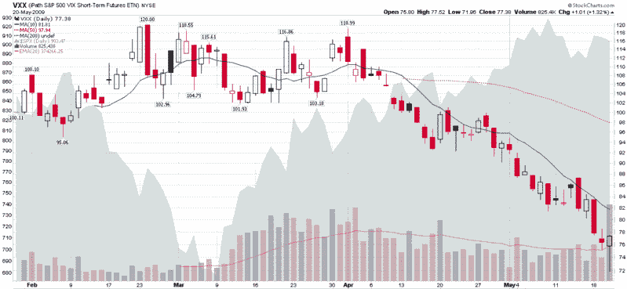

<!--yml

类别：未分类

date: 2024-05-18 17:46:50

-->

# VIX and More: 记录 VXX 的创纪录成交量

> 来源：[`vixandmore.blogspot.com/2009/05/record-volume-in-vxx.html#0001-01-01`](http://vixandmore.blogspot.com/2009/05/record-volume-in-vxx.html#0001-01-01)

尽管所有人的目光今天早上都在关注 VIX 的大跳水，但我没有听到任何关于 VIX ETN，[VXX](http://vixandmore.blogspot.com/search/label/VXX)的讨论。诚然，VXX 没有其指数 counterpart 那样性感或波动大，但 VXX 今天还是从 2 月份的高点下跌了超过 40%，创下了新的日内最低点 71.96，然后尾盘反弹，以 77.38 的价格收盘，全天上涨了 1.32%。

然而，真正引起我注意的是今天创纪录的 825,338 股成交量。由于 VXX 还不到四个月大，交易员们还在了解这个产品的[一些独特之处](http://vixandmore.blogspot.com/2009/04/lost-in-translation-vxx-and-vxz.html)。考虑到 VXX 不能被做空（至少在我的账户里是这样），在过去两个半月里波动性崩溃的过程中，对这个产品的投机兴趣非常有限。

然而，今天的关键信息是，使用 VXX 投注波动性的投注数量创下了纪录。我怀疑我并不是唯一一个认为我们可能刚刚看到了[VIX 底部](http://vixandmore.blogspot.com/2009/05/where-will-vix-bottom.html)的人。

今天也可能是 VXX 除了作为对冲工具之外，首次显示出可能成为一个出色的投机工具的迹象。由于 VXX 的平均日内波动幅度接近 5%，日变动接近 3%，VXX 甚至可能加入三倍 ETFs 的行列，成为首选的日交易工具。VIX 在成为交易社区的标准之前还有很长的路要走，但今天绝对是朝着那个方向迈出的重要一步。

[来源：StockCharts]

***披露：***写作时持有 VIX 和 VXX.*
