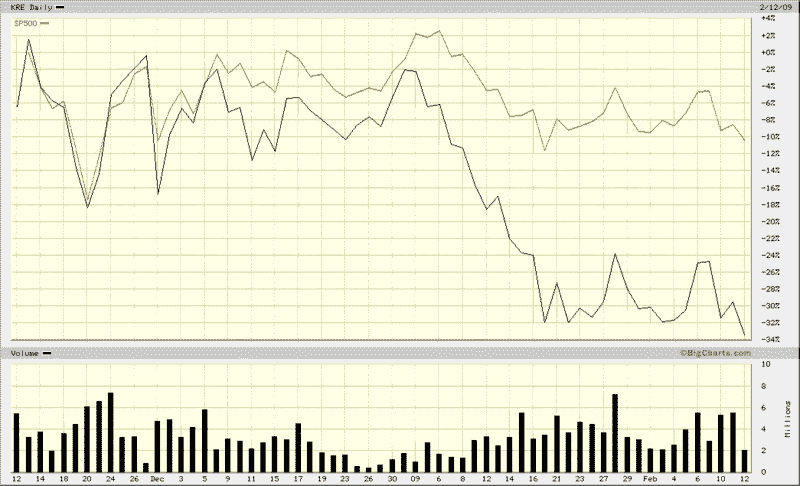

<!--yml

类别：未分类

日期：2024-05-18 18:00:26

-->

# 波动率与更多：地区银行陷入困境

> 来源：[`vixandmore.blogspot.com/2009/02/regional-banks-in-trouble.html#0001-01-01`](http://vixandmore.blogspot.com/2009/02/regional-banks-in-trouble.html#0001-01-01)

尽管 2009 年的前六周股市出现了局部乐观情绪，但一个明显缺席偶尔购买活动的是金融部门。在金融部门内，最弱的是地区银行，它们从 TARP 2.0 中获益甚微，如果消费者信贷危机继续加深，几乎每个人都预计这将是最有可能的情况，那么它们可能会损失惨重。

在下面的三个月图表中，你可以看到自今年年初以来，标普 500 指数已经放弃了自 11 月 21 日低点以来的一半涨幅。另一方面，地区银行（在这里由[KRE](http://finance.yahoo.com/q?s=KRE)，一个 ETF 代表）急剧跌破了 11 月的低点，现在甚至低于 1 月和 2 月初的低点。

几乎没有疑问，地区和本地银行面临着巨大的基本挑战。我看到了一些估计，有 10%甚至更多的银行在经济恢复健康之前可能会失败。

如果地区银行继续反映估值恶化，我认为大盘要摆脱这种担忧并实现显著反弹是很难的。至少，我期望市场在地区银行股票能够脱离生命支持之前，不会比震荡盘整好多少。

*[来源：BigCharts]*
