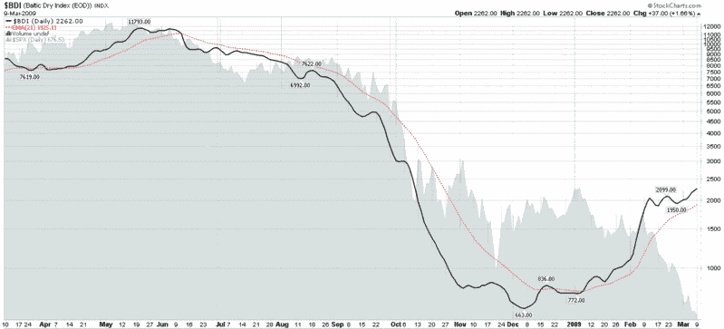

<!--yml

分类：未分类

日期：2024-05-18 17:56:35

-->

# VIX and More: 波罗的海干货指数上升是商品底部到来的信号？

> 来源：[`vixandmore.blogspot.com/2009/03/rising-baltic-dry-index-sign-of.html#0001-01-01`](http://vixandmore.blogspot.com/2009/03/rising-baltic-dry-index-sign-of.html#0001-01-01)

2008 年的最后一天，我敦促读者[关注 2009 年的波罗的海干货指数](http://vixandmore.blogspot.com/2008/12/watch-baltic-dry-index-in-2009.html)以寻找全球贸易强度的线索。

为了快速回顾，[波罗的海干货指数](http://en.wikipedia.org/wiki/Baltic_Dry_Index)（BDI）衡量的是运输[干货运输船](http://en.wikipedia.org/wiki/Bulk_carrier)的运费率，这些船只运输煤炭、铁矿石和其他矿石、可可、谷物、磷酸盐、肥料、动物饲料等商品。

虽然我之前已经记录过世界上几个最重要的出口经济体生产的大幅下降，但根据波罗的海干货指数，运费率在 12 月开始上升，并在过去六周急剧上升。今年年初，原油和铜价开始企稳，[商品](http://vixandmore.blogspot.com/search/label/commodities)总体上相对表现出色。公平地说，商品的一些看涨行为是由于对 proposed Chinese stimulus package 增加的预期。然而，鉴于北京最近宣布的刺激措施未达到期待，现在必须考虑这样一个问题：波罗的海干货指数和商品价格能够在没有增加政府支出计划的情况下延续近期涨势。这一发展提出了商品可能确实正在触底的可能性。

*[来源：StockCharts]*
