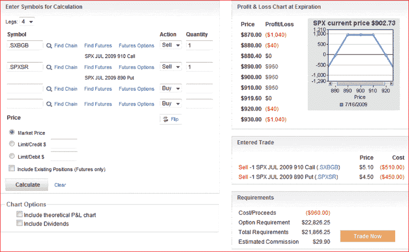

<!--yml

分类：未分类

date: 2024-05-18 17:38:37

-->

# VIX and More: Round Number Magnet Strangle

> 来源：[`vixandmore.blogspot.com/2009/07/round-number-magnet-straddle.html#0001-01-01`](http://vixandmore.blogspot.com/2009/07/round-number-magnet-straddle.html#0001-01-01)

round numbers 的力量似乎并没有在投资圈子里得到很多重视。当然，指数或股票穿越 round number 上方或下方有心理意义，但令我惊讶的是，没有人谈论如何交易这些。

与其将 round numbers 视为潜在的增强支撑或阻力区域，我更喜欢认为它们具有强大的吸引力，几乎就像是大磁铁。在某些指数和股票中，价格在 round numbers 附近停留的时间比随机分布建议的时间要长。

利用 round numbers 吸引人的倾向之一的方法之一是出售接近该行权的期权。[宽跨式](http://vixandmore.blogspot.com/search/label/straddle)、[宽跨式](http://vixandmore.blogspot.com/search/label/strangle)、[蝴蝶式](http://vixandmore.blogspot.com/search/label/butterfly)和铁[乌鸦](http://vixandmore.blogspot.com/search/label/condor)策略当然都是合适的选择，但我个人更喜欢宽跨式，因为其有较宽的最大利润区间和简单的构建/持仓管理。

这些“磁力跨越”策略可以利用任何期限的期权，但最大[时间衰减](http://vixandmore.blogspot.com/search/label/time%20decay)（[theta](http://vixandmore.blogspot.com/search/label/theta)）在到期前几周达到。在下面的图表中，该图表由 optionsXpress 提供，我展示任何对出售 SPX 的 890-910 区间宽跨式期权感兴趣的人，如果指数在到期前最后三天内能够保持在 40 点（880-920）的区域内，那么就能获利。

我觉得有必要提一下，传统智慧认为到期周存在短期不确定性过高和[gamma 风险](http://www.investopedia.com/university/option-greeks/greeks5.asp)，以至于不能在一致的基础上获利，然而，我认为有许多机会概率有利于有经验的期权交易员。

最后，如果这个交易听起来有些熟悉，读者可能想查看一下去年 12 月的一篇类似宽跨式交易文章 [Is the SPX Going to Stick Close to 900?](http://vixandmore.blogspot.com/2008/12/is-spx-going-to-stick-close-to-900.html)。当原始交易被讨论时，VIX 在 50 多以上，840-960 的利润区间使得按照当前波动性标准来看，看起来是一个稳赚不赔的交易。

*[graphic: optionsXpress]*
