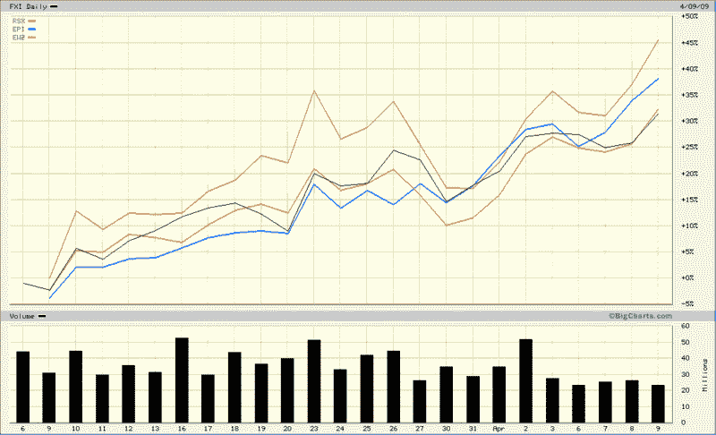

<!--yml

分类：未分类

日期：2024-05-18 17:52:19

-->

# VIX and More: Russia Leading the BRIC Rally

> 来源：[`vixandmore.blogspot.com/2009/04/russia-leading-bric-rally.html#0001-01-01`](http://vixandmore.blogspot.com/2009/04/russia-leading-bric-rally.html#0001-01-01)

上次我关注[BRIC](http://vixandmore.blogspot.com/search/label/BRIC)国家的情况是在四个月前，当时的热门话题是[BRIC 更新：中国是一个领导者还是一个异类？](http://vixandmore.blogspot.com/2008/12/bric-update-china-leader-or-outlier.html)。当时，[中国](http://vixandmore.blogspot.com/search/label/China)正从十月的低点强劲反弹，而[俄罗斯](http://vixandmore.blogspot.com/search/label/Russia)则是一个明显的落后者。

正如下面图表所示，自美国股市指数触底以来的五周里，表现最强劲的是俄罗斯（[RSX](http://vixandmore.blogspot.com/search/label/RSX)，红线），其次是印度（[EPI](http://vixandmore.blogspot.com/search/label/EPI)，蓝线），而巴西（[EWZ](http://vixandmore.blogspot.com/search/label/EWZ)，金线)和中国（[FXI](http://vixandmore.blogspot.com/search/label/FXI)，黑线)则相对落后。

我密切关注这些关系的原因有很多，其中之一就是为了判断整个群体表现如何，是否有某个国家脱颖而出，商品生产商或消费者是否受到青睐等等。

俄罗斯反弹幅度超过其金砖四国(BRIC)同伴的部分原因在于，俄罗斯在最近的市场熊市中遭受了不适当的打击。从 2008 年 6 月到 2009 年 2 月的九个月里，RSX 俄罗斯 ETF 的价值损失了超过 82%。然而，过去的一个月里，情况有了显著的改善。俄罗斯的[信用违约互换](http://vixandmore.blogspot.com/search/label/credit%20default%20swaps)就是一个例子，它反映了保险国家债务的成本，在过去的四周里从 694 下降到 412，反映出该国主权债务的前景有了显著的改善。

展望未来，特定国家的趋势可能会继续占主导地位，但我怀疑俄罗斯和巴西的相对表现将更多地说明商品市场整体的改善，而不是特定国家经济的困境。

来源：[BigCharts]*
