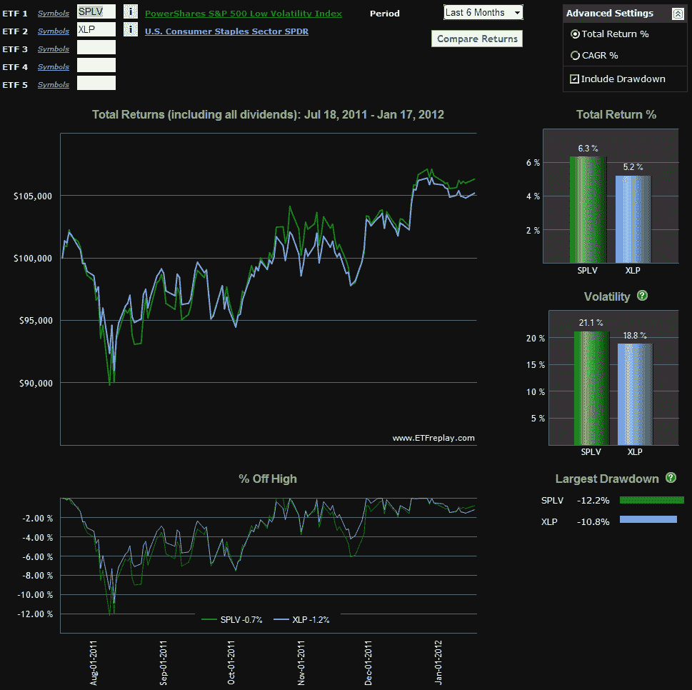

<!--yml

category: 未分类

date: 2024-05-18 16:43:02

-->

# VIX 和更多：SPLV 对 XLP

> 来源：[`vixandmore.blogspot.com/2012/01/splv-vs-xlp.html#0001-01-01`](http://vixandmore.blogspot.com/2012/01/splv-vs-xlp.html#0001-01-01)

我越想这个问题，就越不理解为什么还需要更多的低波动性 ETP。当然，我明白在波动性高的市场中，许多投资者希望有一个更为保守的组合，能够抵御错误方向的剧烈波动。

在这方面，我多少能理解非常受欢迎的 [PowerShares S&P 500 低波动性组合](http://www.invescopowershares.com/products/overview.aspx?ticker=SPLV)ETN ([SPLV](http://vixandmore.blogspot.com/search/label/SPLV)) 的吸引力，该 ETN 自去年 5 月上市以来已经吸引了超过 10 亿美元的资产。就在上周，在 [比较 SPLV 和 VQT](http://vixandmore.blogspot.com/2012/01/comparing-splv-and-vqt.html) 中，我注意到 SPLV 降低波动性的方法是“重防御股票，当前的顶级行业分配在公用事业、消费品和医疗保健股票。” 事实上，在最近的季度重新平衡之后，SPLV 目前将其组合的约 31% 投资于公用事业，另外 30% 投资于消费品。 *[查看 SPLV 的前十大持股 [这里](http://www.invescopowershares.com/products/holdings.aspx?ticker=SPLV)]*

所以 SPLV 提供了什么比投资于像 [XLU](http://vixandmore.blogspot.com/search/label/XLU) 这样的公用事业 ETF 或像 [XLP](http://vixandmore.blogspot.com/search/label/XLP) 这样的消费品 ETF 更多的优势呢？就我所能看到的而言，并不多。在性能方面，XLU 在 2011 年压倒了 SPLV，如下图所示，自去年 5 月 SPLV 上市以来，区分 SPLV 和 XLP 的表现就像是在 splitting hairs —— 尽管公平地说，最近的重新平衡可能使差距更加明显。

可以认为，使用低波动性股票的其他方法（如 XLU）在降低波动性方面至少同样有效，就像那些基于市场波动性和 [风险](http://vixandmore.blogspot.com/search/label/risk)评估的动态对冲分配的 ETP 一样。我在 [比较 SPLV 和 VQT](http://vixandmore.blogspot.com/2012/01/comparing-splv-and-vqt.html) 中提到了其中的两个，特别是 [VQT](http://vixandmore.blogspot.com/search/label/VQT) 和 [VSPY](http://vixandmore.blogspot.com/search/label/VSPY)。

在我看来，盲目追求低波动性就像因为害怕 turbulence 而避免乘坐飞机一样。虽然这可以理解，但乘坐 cross-country train 到达目的地的时间会更长。

考虑到投资领域的差异，我意识到并非所有人都将市场波动视为增强机遇的时期，因此在 2012 年，我将在这个博客中定期探讨的一个主题是如何降低风险、进行套期保值并生成收入——尽管这些内容不一定同时进行。

与此同时，考虑一下个人的座右铭，“*在波动中*，*存在机会*！

相关文章：

**

*[来源(s): ETFreplay.com]*

****披露事项(s):*** *无*
