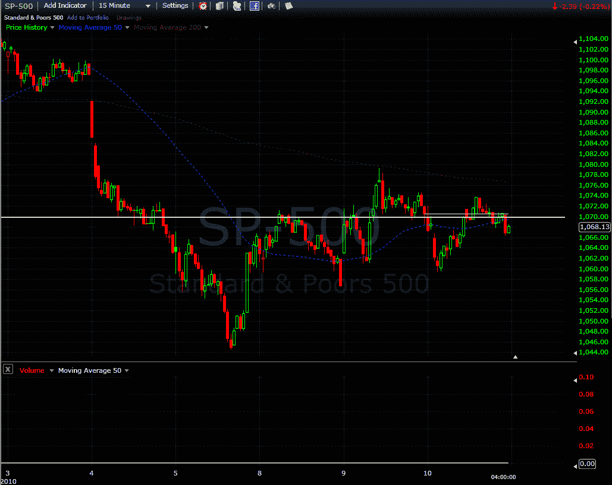

<!--yml

分类：未分类

日期：2024-05-18 17:15:51

-->

# VIX and More: SPX 1070 Looms Large…Again

> 来源：[`vixandmore.blogspot.com/2010/02/spx-1070-looms-largeagain.html#0001-01-01`](http://vixandmore.blogspot.com/2010/02/spx-1070-looms-largeagain.html#0001-01-01)

就像任何股票指数一样，有时标普 500 指数似乎会挑选一个数字，并使其成为一个重要的支撑和阻力水平。有时这些底线是短暂的，有时它们会持续较长时间。

以 SPX 1070 为例。回到 2009 年 10 月，SPX 1070 恰好是我在[Strangle Pong](http://vixandmore.blogspot.com/2009/10/strangle-pong.html)以及随后的两篇文章中提到的 SPX 交易区间的中点（见下方的链接。）

自上周四以来，SPX 1070 似乎又开始重新确立自己的地位。在下面的图表中，2 月 4 日，1070 作为关键支撑持续了一段时间，然后在 8 日作为阻力。昨天和今天，1070 某种程度上充当了支点，既是支撑也是阻力。随着今天收盘时 1070 刚刚在上方，而期货目前指向明天开盘多方占优，我将密切关注 SPX 在突破或跌破 1070 水平时的表现。

对于关于 Strangle Pong 以及相关主题的文章，读者们被鼓励去查看以下内容：

***披露信息：*** *在撰写本文时，对 SPX 持中性立场，通过期权进行操作*

来源：[FreeStockCharts.com]
