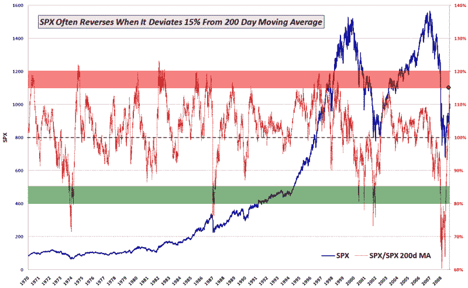

<!--yml

分类：未分类

日期：2024-05-18 17:35:33

-->

# 波动率指数与更多：标普 500 指数首次十年来超过 200 天移动平均线 15%

> 来源：[`vixandmore.blogspot.com/2009/08/spx-15-over-200-day-moving-average-for.html#0001-01-01`](http://vixandmore.blogspot.com/2009/08/spx-15-over-200-day-moving-average-for.html#0001-01-01)

由于我在其他地方没有看到提及（这并不意味着像过去那样多，因为博客圈的扩大），我认为值得指出，除了首次收盘价超过关键的 1000 点水平以外，标普 500 指数也首次收盘价较其简单移动平均线高出 15%，这种情况是自 1999 年以来首次出现。

在下面的图表中，我展示了标普 500 指数自 1970 年以来的日收盘价（蓝色）以及标普 500 指数与其[200 天简单移动平均线](http://vixandmore.blogspot.com/search/label/200%20day%20SMA)的比率（红色）。随着今天的收盘价（红色菱形），标普 500 指数现在正进入一个经常使标普 500 指数面临反转的均值回归水平。话说回来，200 天移动平均线在未来一个月左右的时间里，每天将上升约 0.40 个点，这意味着横向行动甚至小幅上涨都有助于解决这一比率中的过度现象，并使其回归更典型的范围。

坦白说，我开始认为，如果我们在本周五的就业报告之前看不到一个显著的修正开始，标普 500 指数可能会迅速下跌至 1100 点。当然，在有证据显示多头有致命弱点之前，反对多头将是非常困难的。

寻找相关上行目标的那些人可能会感兴趣地知道，标普 500 指数自 1983 年以来从未收盘价较其 200 天简单移动平均线高出 20%。

有关联的文章，可以尝试阅读：

*[顺便说一句，我不知为何有种冲动，要指出我并没有打算让图表看起来像是某个新兴投资国的国旗…]*

