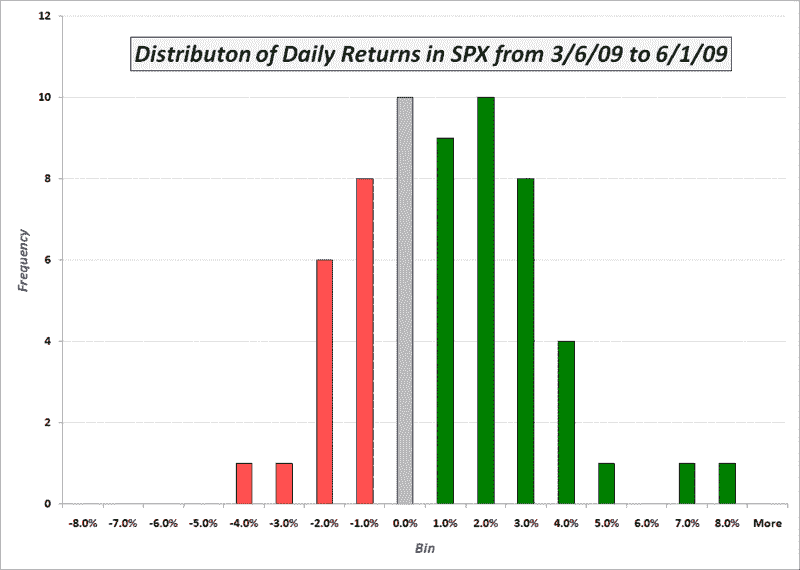

<!--yml

分类：未分类

日期：2024-05-18 17:44:46

-->

# VIX 和更多：自 2009 年 3 月 6 日以来的 SPX 日回报率

> 来源：[`vixandmore.blogspot.com/2009/06/spx-daily-returns-since-3609.html#0001-01-01`](http://vixandmore.blogspot.com/2009/06/spx-daily-returns-since-3609.html#0001-01-01)

最近市场似乎只有两个方向：上涨和横盘。自 3 月 6 日触底以来，情况并非完全如此，但也没有相差太远。

下面的图表是一个直方图，反映了自 3 月触底以来标普 500 指数（SPX）的日回报率频率分布。我用灰色阴影标出了代表回报率在-1%到+1%范围内的柱子。这些日子相对中性。绿色区域的广泛反映了过去三个月里，下跌的日子通常是小幅下跌。另一方面，上涨的日子包括更多的小幅上涨（1-2%范围内），更多的大幅上涨（3-4%范围内），还有两个异常大的上涨，分别是 7.08%和 6.37%。

当然，如果同一时期的周回报率图表会显示出几乎全部为绿色，还有两小片红色…

