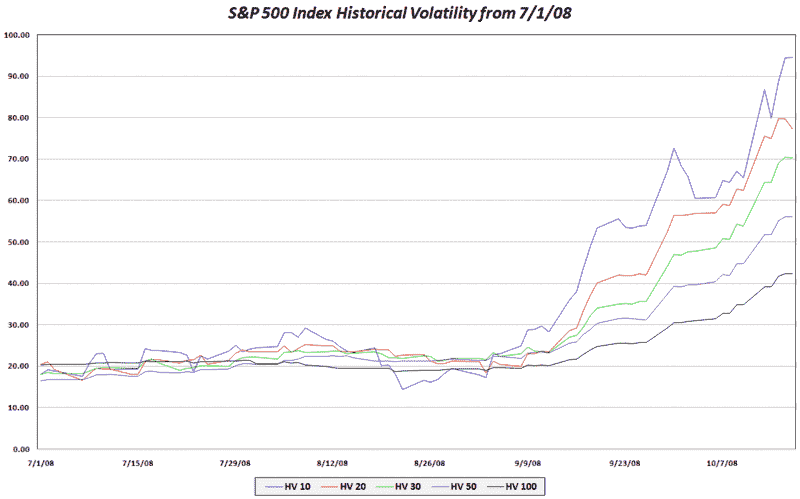

<!--yml

category: 未分类

date: 2024-05-18 18:20:14

-->

# VIX and More: SPX 历史波动率快照

> 来源：[`vixandmore.blogspot.com/2008/10/spx-historical-volatility-snapshot.html#0001-01-01`](http://vixandmore.blogspot.com/2008/10/spx-historical-volatility-snapshot.html#0001-01-01)

Adam 在周末的[Daily Options Report](http://adamsoptions.blogspot.com/)中发表了一篇文章，他解释了为什么他最近[偏好 10 天历史波动率胜过 30 天波动率](http://adamsoptions.blogspot.com/2008/10/why-10-day-vol-over-30-day-vol.html)。

鉴于我追踪了大量[历史波动率](http://vixandmore.blogspot.com/search/label/historical%20volatility)数据，我认为发布一张显示通过各种滚动回望期（从 10-100 天不等）计算出的历史波动率的图表可能会很有趣。（本质上，这是回报对数的标准差。）结果表明，在过去两个月内，历史波动率持续上升，这是过去二十年前所未有的。即便在 1987 年，波动率也没有持续上升这么长时间。

随着 VIX 接近 70，在我写下这些文字时，它此刻最接近 30 天历史波动率。向前看，我会有更多关于历史波动率的内容要讲，包括[隐含波动率](http://vixandmore.blogspot.com/search/label/implied%20volatility)，以及这两者之间的相互影响。

[来源：VIX and More]
