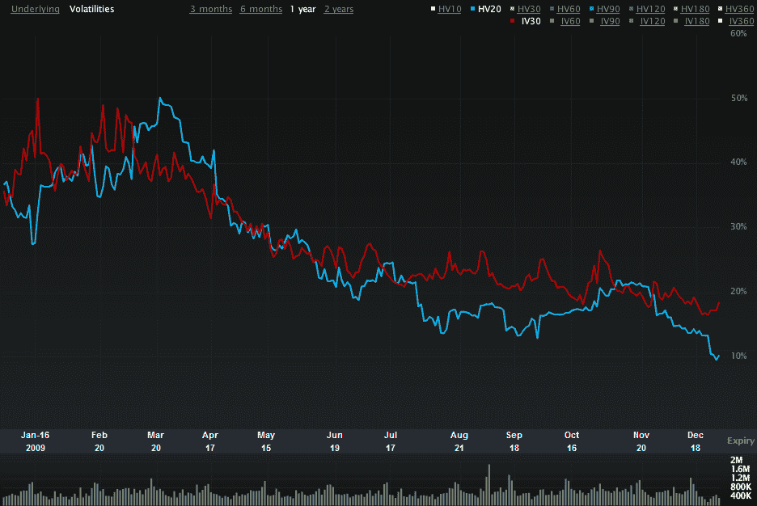

<!--yml

分类：未分类

日期：2024-05-18 17:18:20

-->

# VIX and More: SPX Historical Volatility at Two Year Low

> 来源：[`vixandmore.blogspot.com/2010/01/spx-historical-volatility-at-two-year.html#0001-01-01`](http://vixandmore.blogspot.com/2010/01/spx-historical-volatility-at-two-year.html#0001-01-01)

虽然广泛认为 VIX 在假期期间（主要由于交易天数减少）倾向于下降，但许多评论家忽略了一个事实，那就是过去几周内[历史波动率](http://vixandmore.blogspot.com/search/label/historical%20volatility)（HV）过低。事实上，上周三 SPX 的 20 天历史波动率首次跌破 10.00，这是自 2007 年 10 月以来首次，大约在 SPX 触及 1576 顶点一周后。

2009 年底，SPX 历史波动率确实略有上升至 10.23，但即便在这个水平，HV 也只处于过去十年 SPX 20 天历史波动率读数的第 17 个百分位。

记录一下，低 HV20 读数推动周五 VIX 对 SPX HV20 的比率达到了 2.12，这个水平在过去十年中只出现过四次。其中三次（2000 年 1 月、2002 年 1 月和 2007 年 5 月）在大规模抛售之前发生。

下面的图表展示了最近 SPX 30 天[隐含波动率](http://vixandmore.blogspot.com/search/label/implied%20volatility)（红线）与 20 天历史波动率（蓝线）之间的分歧。通常情况下，当 IV 远高于 HV 时，这是一个看跌信号——至少是一个获利的好时机。

关于相关主题的更多信息，读者可以查阅：

来源：[Livevol Pro]

**披露：** *Livevol 是 VIX 和 More 的广告商*
