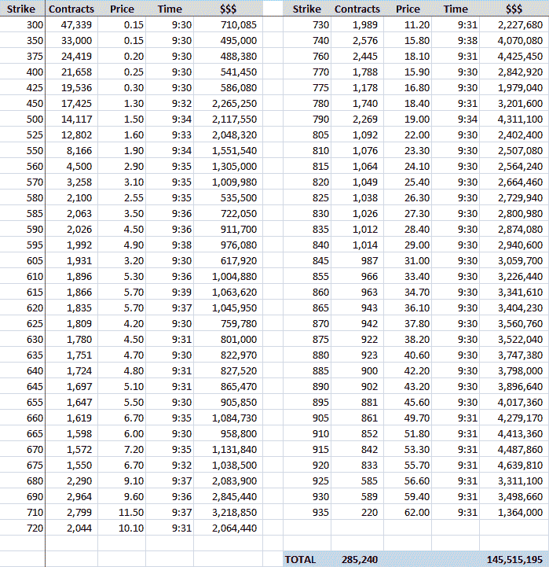

<!--yml

category: 未分类

date: 2024-05-18 18:19:35

-->

# VIX and More: SPX Options Carpet Bomb Pushes VIX SOQ to 63.04 (!)

> 来源：[`vixandmore.blogspot.com/2008/10/vix-soq-at-6304.html#0001-01-01`](http://vixandmore.blogspot.com/2008/10/vix-soq-at-6304.html#0001-01-01)

Kudos to Adam at Daily Options Report for getting all over the VIX expiration story a little earlier. In [Time for an In-VIX-Tigation?](http://adamsoptions.blogspot.com/2008/10/time-for-in-vix-tigation.html) Adam wonders about the large number of SPX options trades at the open today.

在下面的表格中，我重建了这次攻击的详细信息，这次攻击似乎涉及购买了近 300,000 份看跌期权（所有这些都是该执行价格的开仓交易）以及大约 1.5 亿美元的大规模投资。

This transaction pushed the VIX from a close of 53.11 on yesterday to a special opening quotation (for the settlement of VIX options) of 63.04, a 9.93 (18.7%) jump over yesterday's close. If I am able to unearth any additional details about this transaction, I will pass them along.

[source: VIX and More]
