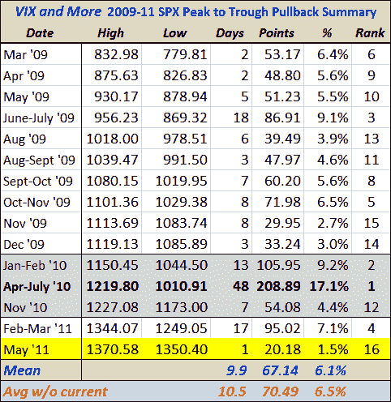

<!--yml

类别：未分类

日期：2024-05-18 16:50:33

-->

# VIX 和更多：SPX 回调历史，2009-2011

> 来源：[`vixandmore.blogspot.com/2011/05/spx-pullback-history-2009-2011.html#0001-01-01`](http://vixandmore.blogspot.com/2011/05/spx-pullback-history-2009-2011.html#0001-01-01)

由于 2011 年股市至今只有一次重大回调，我把过去两天温和的卖盘当作更新一个我自 2009 年 3 月股市触底以来定期更新的回调表的借口。

表格捕捉了过去 26 个月里 SPX 发生的十五次重大回调（在规模和/或持续时间上）的一些细节，当前的回调——到目前为止从高点到低点仅回调了 1.5%——用黄色高亮显示。

如果不算当前的 1.5%回调，平均回调从高点下来达到了 6.5%，中位数是 5.6%。使用这些数字，中位数回调会把 SPX 带到大约 1294，平均回调会让指数降到略高于 1286。

如果出现一个与 2010 年 4 月至 6 月 17.1%的回调相匹配的回调，这是牛市期间最大的回调，SPX 将回调至 1136。

当你考虑当前的卖盘和最近的买低投资者倾向于让大多数回调不会太过严重时，这一段历史基准应该能够作为评估下一个回调可能有多深、多长的参考指南。

***披露(s)：**没有*
