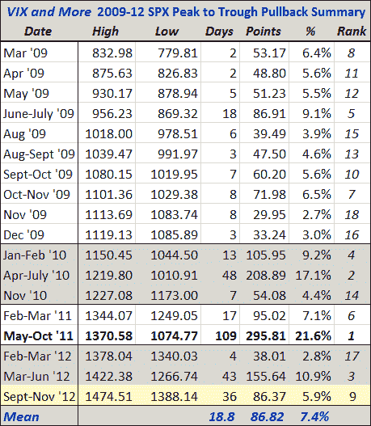

<!--yml

分类：未分类

date: 2024-05-18 16:23:25

-->

# VIX 和更多：SPX 回调达到 5.9%，自 2009 年 3 月牛市开始以来第四长的跌幅

> 来源：[`vixandmore.blogspot.com/2012/11/spx-pullback-hits-59-fourth-longest.html#0001-01-01`](http://vixandmore.blogspot.com/2012/11/spx-pullback-hits-59-fourth-longest.html#0001-01-01)

标普 500 指数今天最低跌至 1388 点，较 9 月 14 日的高点 1474 点下跌了 86 点，或 5.9%。

下表总结了自 2009 年 3 月低点以来 SPX 的所有高峰到低谷回调。注意，虽然 5.9%的跌幅在跌幅幅度中游，但股票下跌了 36 天，使当前回调在高峰到低谷持续时间上排名第四。当然，这些统计数据都假设今天的低点将标志着一个底部——虽然最近的市场行动支持这一观点，但无法保证 SPX 1388 能够稳住。

值得注意的是，2012 年是第一个看到一个月以上回调超过一次的年份。有几种解释方式。当然，其中之一是，近期出现的弱势持续了很长时间。另一种解释可能是，牛市在低谷时买入的倾向减弱，降低了股票急剧下跌的可能性。

系列帖子：

**

*[来源：雅虎]*

***披露：*** *无*
