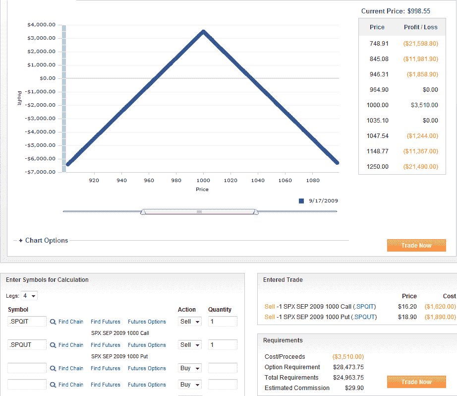

<!--yml

分类：未分类

日期：2024-05-18 17:30:52

-->

# VIX 和更多：SPX 短期对冲仍徘徊在 1000 点水平

> 来源：[`vixandmore.blogspot.com/2009/09/spx-short-straddle-still-hugging-1000.html#0001-01-01`](http://vixandmore.blogspot.com/2009/09/spx-short-straddle-still-hugging-1000.html#0001-01-01)

在许多方面，终极纯粹的波动率下降玩法就是卖出一个 SPX 短期对冲，同时卖出接近行权价的看跌和看涨期权，希望标的资产在到期前变动很小。虽然这主要是中性方向性投注，但它也是对波动率下降的投注。

两周前的今天，在[横向交易](http://vixandmore.blogspot.com/2009/08/sideways-play.html)中，我概述了当 SPX 为 1004 时短期对冲交易看起来会怎样的逻辑和细节。两周后，SPX 下跌了五点以上，这笔交易是盈利的。这笔交易正在从[时间衰减](http://vixandmore.blogspot.com/search/label/time%20decay)（[theta](http://vixandmore.blogspot.com/search/label/theta)）中获利，目前为-1.20，意味着在其他条件相同的情况下（即如果价格、隐含波动率和利率不变），头寸每天将增加 120 美元。

当然，影响期权价格的其他变量也在变动。期权交易员使用期权的[希腊字母](http://vixandmore.blogspot.com/search/label/greeks)来衡量期权对影响期权价值的各种因素的敏感性，包括标的资产的价格、标的资产的波动性、时间和利率。

对于 SPX 短期对冲，过去几天隐含波动率（VIX）的上升对期权头寸产生了不利影响。衡量期权对隐含波动率变化的敏感性的希腊字母是[vega](http://vixandmore.blogspot.com/search/label/vega)（不是一个希腊字母，但根据期权传统被认为是一个“希腊字母”），它估计的是由于标的资产的隐含波动率变化 1%而导致期权价值变化的情况。在过去两周内，VIX 上升了 2.30 点，而 SPX 对冲目前具有 vega 值 1.61，这意味着 VIX 的 2.30 点上升使头寸在十个交易日内损失了大约 370 美元。

虽然在这个短期对冲交易中有其他因素在起作用，但到目前为止，主要情节是 theta 与 vega 的故事，时间衰减占据了上风。

下面的图表显示，一个原本能产生$5000 收益的期权位置现在可以以$3510 购回，这将锁定$1490 的利润。随着期权到期日仅剩两周，以及随着到期日的临近时间价值衰减开始加速，这个空头跨式策略将如何发展将会很有趣。

有关相关文章，可以尝试阅读：

**[图表来源：optionsXpress]**
