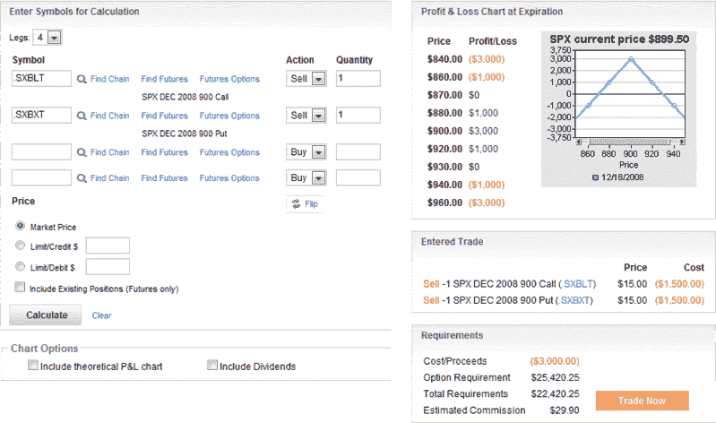

<!--yml

分类：未分类

日期：2024-05-18 18:10:20

-->

# VIX 和更多：SPX 铁蝶式期权案例研究更新

> 来源：[`vixandmore.blogspot.com/2008/12/spx-straddle-case-study-update.html#0001-01-01`](http://vixandmore.blogspot.com/2008/12/spx-straddle-case-study-update.html#0001-01-01)

我在博客上提到的潜在交易很少，当我这样做时，只是为了说明目的。因此，我很少觉得有必要跟进之前识别出的潜在交易。

然而，今天似乎是一个太好而不能忽视的机会，因为时机和数学运算非常凑巧地完美结合。

整整一周前，在[SPX 是否会稳定在 900 附近？](http://vixandmore.blogspot.com/2008/12/is-spx-going-to-stick-close-to-900.html)一文中，我概述了我的观点，我认为 SPX“将会在 820-980 的交易区间内稳定”。我还提到了“SPX 可能会在 900 附近开始感受到一些重力作用，并开始在一个更狭窄的范围内交易，900 区域变成了一种无人区”。

对于那些可能对市场有相似看法并且正在寻找波动性作为收入的人来说，我建议了一系列策略，包括[铁蝶式期权](http://vixandmore.blogspot.com/search/label/straddle)、[宽跨式期权](http://vixandmore.blogspot.com/search/label/strangle)、[倒置宽跨式期权](http://vixandmore.blogspot.com/search/label/condor)和[飞鹰式期权](http://vixandmore.blogspot.com/search/label/butterfly)。

我选择通过使用标普 500 指数（SPX）作为基础资产的短蝶式期权来展示一个可能的区间交易。当 SPX 的交易价格略高于 900 时，每个看涨和看跌期权都可以以 30.00 美元的价格出售。快进一周，SPX 仍然在 900 附近徘徊。经过一周的时间衰减，VIX 在此期间下跌了大约 10%，看涨和看跌期权的价格都减半，从 30.00 美元降至 15.00 美元。

随着到期日的接近，期权交易从投资的范畴转变为碰运气，但看到一个实际案例研究中，所有数字随着时间的推移而表现如教科书中所描述的那样，这是有趣的。

来源：optionsXpress
