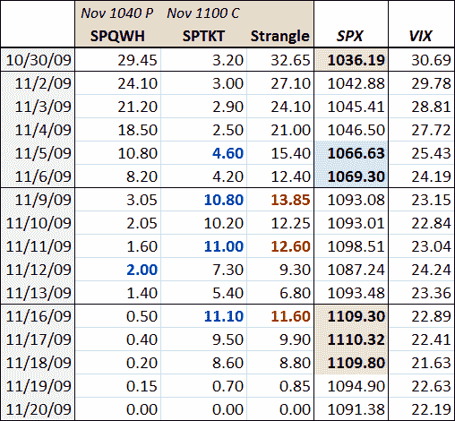

<!--yml

分类：未分类

date: 2024-05-18 17:22:12

-->

# VIX and More: SPX Strangle Pong Post-Mortem

> 来源：[`vixandmore.blogspot.com/2009/11/spx-strangle-pong-post-mortem.html#0001-01-01`](http://vixandmore.blogspot.com/2009/11/spx-strangle-pong-post-mortem.html#0001-01-01)

当我第一次提出[Strangle Pong](http://vixandmore.blogspot.com/2009/10/strangle-pong.html)（一种分批卖出 SPX 一个月期[strangle](http://vixandmore.blogspot.com/search/label/strangle)的策略）的想法时，我有意定期跟进，对这一策略的效果、是否成功以及交易员如何管理像文中讨论的那种头寸等问题发表评论，以实现风险最小化同时获取大部分利润潜力。

在[Strangle Pong Update](http://vixandmore.blogspot.com/2009/11/strangle-pong-update.html)中，Mark Wolfinger ([Options for Rookies](http://blog.mdwoptions.com/options_for_rookies/))和我讨论了平仓空头看跌交易并获取相当可观的利润的建议。我们同意，为了确保最后 3.65 的利润而保持头寸开放并不是一个吸引人的风险回报玩法，尤其是因为该头寸已经赚取了 20.35 的利润。然而，我得出结论，“出于教育目的，我将在博客上保持这个开放项。”当我发表这个评论时，我没有意识到即将到来的前往夏威夷的旅行*（去大岛，每个人都应该忽略成本，乘坐直升机游览基拉韦厄火山）* 将使我脱离通信网络。此时我剩下的不是我希望的实时分析，而是一个事后分析。通常我认为事后分析不会那么有教益，但在这个案例中，我认为有很多教训可以学习。

起初，虽然我的原始交易逻辑在[到期](http://vixandmore.blogspot.com/search/label/options%20expiration)时得到了回报，但途中的风险并不值得持有至到期，至少对我来说是这样。这是对初学者期权交易员的一个重要观点，他们倾向于将盈亏的期权交易持有至到期，通常导致盈利的交易回吐部分早期利润，而过于频繁的是，亏损的交易到期一文不值。

回顾一下，短线跨式策略背后的想法是利用标普 500 指数在到期周期最后 16 天内 1040-1100 点区间震荡交易的可能性。目标是根据标普 500 指数在区间的哪一端交易来逐步进入该交易。第一阶段是一份立即走势错误的 11 月标普 500 指数 1040 点看跌期权。如下表所示，交易启动当天标普 500 指数突破 1040 点，收盘于 1036 点附近（红色阴影）。最大收益 24 点，第一天结束时交易已经亏损 5.45 点。更重要的是，交易论点中的关键部分——1040 点将提供支撑——已经不再有效。底线是，有充分的理由在第一天止损并平仓。

结果证明，我的市场时机制信号在第二天就证明了其价值，买家涌入，支撑位在 1029-1030 点区间，标普 500 指数开始了接下来 13 个交易日的几乎无间断的上涨行情。5-6 天后，标普 500 指数已经恢复到目标 1040-1100 点交易范围的中部（蓝色阴影），潜在利润的六分之三已经实现。

在到期前的一周，标普 500 指数（SPX）尝试冲击 1100 点但未能成功。那一周，1040 点的看跌期权一路下跌至 1.40 美元，而 11 月 1100 点的看涨期权在周一和周三的价格有所上升（粗体蓝色）。马克和我周一在 8.40 美元时认为风险过高而放弃的 1100 点看跌期权空头位置，从周一到周四都会是亏损的。尽管最终在周五该看跌期权变得有盈利，但随后的一周，标普 500 指数突破 1100 点，周一、周二和周三收盘价接近 1110 点，看涨期权仍然亏损，并存在更大亏损的风险。

回到交易的原始论据，一旦标普 500 指数周一收盘价超过 1100 点，上方阻力被突破，相对较小的回报风险过高。在那个阶段——并且到期前只剩下四天，我会以 3.20 点的亏损平仓。

所以回顾一下，尽管这在纸面上看起来是一个完美的短线跨式策略，看跌和看涨期权都到期无价值，谨慎的风险管理不会导致持有交易至到期。此外，不仅看跌期权的利润会提前实现（从可能的 24.00 点中净得 20.35 点），而且如果启动看涨期权空头（我当时认为这是一个有问题的交易，在跨式策略更新时），我肯定会止损（亏损 3.20 点），而不是给交易机会盈利。

底线是，这笔交易在纸面上看起来很不错，但由于适当的风险管理，其实只算是一个非常好的交易，利润净额只有如果持有到期的话应该获得的 60%。然而，从长远来看，我坚持认为理解现有期权头寸的风险回报概况比试图从每一笔期权交易中提取最大利润更为重要。

对于本系列的前两篇帖子，建议读者去查看一下：

