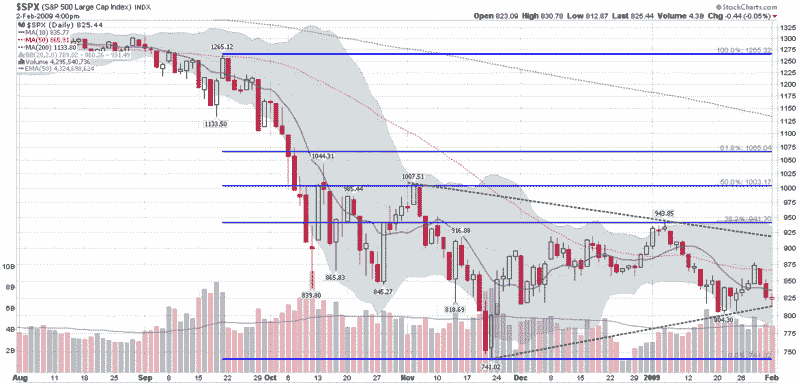

<!--yml

分类：未分类

日期：2024-05-18 18:02:02

-->

# 维克斯与更多：SPX 对称三角形模式即将突破

> 来源：[`vixandmore.blogspot.com/2009/02/spx-symmetrical-triangle-pattern.html#0001-01-01`](http://vixandmore.blogspot.com/2009/02/spx-symmetrical-triangle-pattern.html#0001-01-01)

在下面的图表中，我展示了一个[对称三角形](http://vixandmore.blogspot.com/search/label/symmetrical%20triangle)（虚线绿色线条）在过去 2-3 个月期间在标普 500 指数中形成。随着三角形的缩小，突破行情的潜在可能性——无论哪个方向——都显著增加。

经典技术分析将对称三角形归类为持续模式，这表明突破行情的最可能方向是向下。随着 SPX 目前紧贴模式底部，并且每天需要上涨约 1.7 点才能保持在线上，原地踏步是不够的。相反，市场需要显著的反弹以获得一些喘息空间。

我认为出现显著反弹的可能性依然很大，但时间已经不多了…

*[source: StockCharts]*
