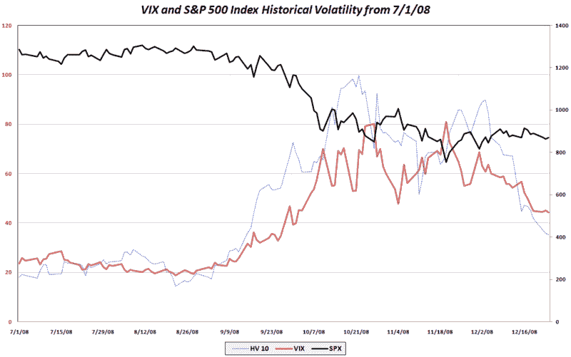

<!--yml

分类：未分类

日期：2024-05-18 18:09:05

-->

# VIX and More: SPX Ten Day Historical Volatility at Lowest Level Since September 12

> 来源：[`vixandmore.blogspot.com/2008/12/spx-ten-day-historical-volatility-at.html#0001-01-01`](http://vixandmore.blogspot.com/2008/12/spx-ten-day-historical-volatility-at.html#0001-01-01)

有很多方法可以用来衡量[历史波动率](http://vixandmore.blogspot.com/search/label/historical%20volatility)。可能最敏感的时期是常用的 10 日历史波动率（HV）期，涵盖过去 10 个交易日。通常被称为统计波动率、实现波动率、实际波动率等，标普 500 的 10 日历史波动率（图表下方的虚线蓝线）在 10 月 22 日达到峰值，略低于 100 点。12 月 3 日，10 日 HV 仍然强劲地维持在 89，但在过去的三周内急剧下降，截至周三收盘时已跌至 35，并且今天可能会进一步降至 33 左右。

用于比较的目的，标普 500 的 10 日 HV 自 2008 年 9 月 12 日以来，也就是雷曼兄弟破产前夕，从未低于 35。

结论是：虽然当前 VIX 在 40 以下可能看起来很便宜，但考虑一下，标普 500 最近的历史波动率一直略高于 VIX 所代表的三分之二。当然，12 月的[假日效应](http://vixandmore.blogspot.com/search/label/Holiday%20Effect)在一定程度上人为地压低了波动率，但肯定不能完全为 10 日 HV 从 89 跌至 35 负责。

来源：[VIX 和更多](http://vixandmore.blogspot.com/search/label/VIX%20and%20More)
