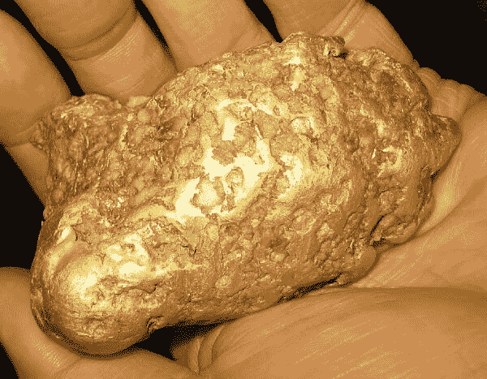

<!--yml

分类：未分类

日期：2024-05-18 18:57:56

-->

# 恐慌指数与更多：标普 500 指数与恐慌指数的相关性琐闻

> 来源：[`vixandmore.blogspot.com/2007/10/spx-vix-correlation-nugget.html#0001-01-01`](http://vixandmore.blogspot.com/2007/10/spx-vix-correlation-nugget.html#0001-01-01)

我最近一直在大力宣传恐慌指数与标普 500 指数的相关性，现在是时候转向其他话题了。

然而，在我这么做之前，我会指导读者参考我之前的一篇帖子，在那篇帖子中我阐述了我对相关性重要性的部分思考。我认为标题已经说明了一切：[恐慌指数与标普 500 指数之间的高正相关性常常预示着市场弱势](http://vixandmore.blogspot.com/2007/05/high-positive-correlation-between-vix.html)。

还有一个近期相关数据的问题。在过去一周半左右的时间里，标普 500 指数（SPX）和恐慌指数（VIX）的相关性异常高，至少与历史数据相比是这样。事实上，标普 500 指数和恐慌指数连续几天显示如此高的相关性上一次还是在…2007 年 2 月 22 日，就在芝加哥期权交易所（CBOE）开始追踪恐慌指数（VIX）以来的最大恐慌指数跳升前三天的日子。现在在任何人急于下结论之前，需要说明的是，本世纪迄今为止，有八个与当前幅度相当的相关性‘尖峰’，但它们都没有导致标普 500 指数出现显著的变动，因此在当前环境下，历史记录至多只能说是模棱两可的。
