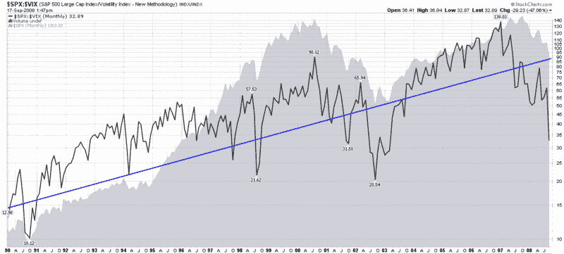

<!--yml

分类：未分类

日期：2024-05-18 18:26:22

-->

# 恐慌指数(VIX)与更多：标普 500 指数与恐慌指数(VIX)比例创下远离趋势线记录

> 来源：[`vixandmore.blogspot.com/2008/09/spxvix-ratio-sets-record-for-distance.html#0001-01-01`](http://vixandmore.blogspot.com/2008/09/spxvix-ratio-sets-record-for-distance.html#0001-01-01)

目前市场恐慌情绪引发的极端数值有很多。由于本博客强调波动性，我想分享一个从长期视角看待波动性的指标：标普 500 指数与恐慌指数(VIX)的比例([SPX:VIX 比例](http://vixandmore.blogspot.com/search/label/SPX%3AVIX))。

在下面的图表中，我创建了一个追踪标普 500 指数与恐慌指数(VIX)比例回到 1990 年首次 VIX 数据的图表。除了比例（黑线）和标普 500 指数（灰色区域图表）之外，我还包含了一条蓝色线条，代表标普 500 指数的 10%长期趋势线（更多信息，可以尝试[标普 500 指数与恐慌指数(VIX)的关系](http://vixandmore.blogspot.com/2007/02/spxvix-relationship.html)）。关键的启示是，当前标普 500 指数与恐慌指数(VIX)的比例在 19 年 VIX 数据的记录中，比趋势线更低的位置还要低。

值得一提的是，自 2007 年 1 月以来，标普 500 指数与恐慌指数(VIX)的比例一直在稳步下降，大约 21 个月前。在 2000-2002 年的熊市期间，标普 500 指数与恐慌指数(VIX)的比例在下降趋势中又维持了三个月（共 24 个月）。

标普 500 指数与恐慌指数(VIX)的比例往往会在长期趋势线附近呈现均值回归的特征，但正如图表所显示的，回归均值的道路可能既漫长又艰难。

[source: StockCharts]
