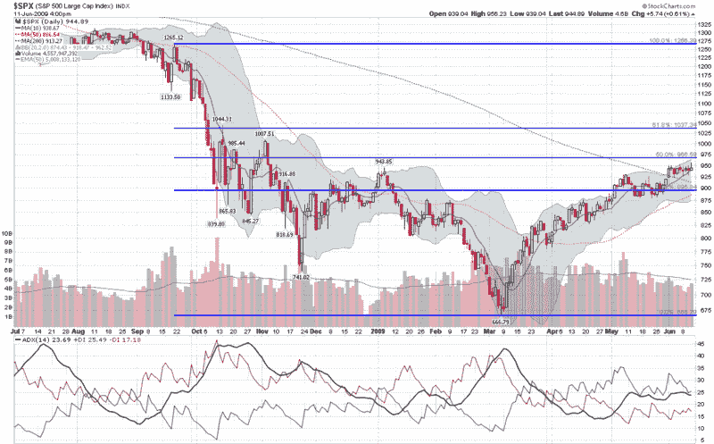

-   <!--yml

-   category: 未分类

-   date: 2024-05-18 17:43:14

-   -->

# -   VIX and More: SPX and Fibonacci Resistance at 966

> 来源：[`vixandmore.blogspot.com/2009/06/spx-and-fibonacci-resistance-at-966.html#0001-01-01`](http://vixandmore.blogspot.com/2009/06/spx-and-fibonacci-resistance-at-966.html#0001-01-01)

-   在昨天 SPX 956 点的上涨高峰时，一位评论者因为我面对着多头行情却持有熊市偏见而对我进行了批评。当时，我准备平掉大部分的空头头寸，但这一决定取决于市场收盘的情况。结果，收盘时的空头动力足够让我保留我的空头头寸。

-   在上涨市场中，有两件事我是确信无疑的：

1.  -   预测一个强劲的多头行情何时会耗尽动力非常困难。

1.  -   在生活中，没有什么比在牛市推高股价到新的高点时持有空头头寸更令人沮丧/昂贵的了

-   将上述两个想法结合起来，明智的做法是等待一个顶部确立，并且至少有一个更高的高点出现之后，再考虑建立空头头寸。然而，也有一个理由可以预期市场的一些反转，当前情况有三个重要的因素：阻力；下降动力；以及一个 ripe for reversal 的大幅运动。

-   下方的图表突出了一些这些问题。我在图表中添加了以蓝色显示的斐波那契回撤线，其起始点为雷曼兄弟破产后九月份的高点。关键的雷曼兄弟破产后的斐波那契阻力位在 SPX 的 966 点，这代表了 1265 点的高位和 666 点的低位之间的中点。就下降动力而言，除了明显的近期震荡交易范围外，平均方向指标（[ADX](http://vixandmore.blogspot.com/search/label/ADX)）显示趋势强度（图表底部黑色线条）在 25 点以下停滞，这表明一个弱势趋势。此外，正方向指标（+DI，绿色线条）显示正面动量的丧失更为迅速。最后，从 666 点到 956 点的运动超过了 43%，并且在这一过程中没有出现任何有意义的回调。换句话说，这是一个 ripe for retracement 的大幅运动。

-   当然，还有许多其他的技术因素可以支持熊市观点，但这概述了基本前提。

-   目前我是空头，但头寸相对较小。如果空头显示出有能力获得一些动力，我将迅速增加这一头寸。

-   如果 SPX 收盘价超过 967 点，我将平掉我的空头头寸，转为更加看多的立场。

-   

-   *[来源：StockCharts]*
