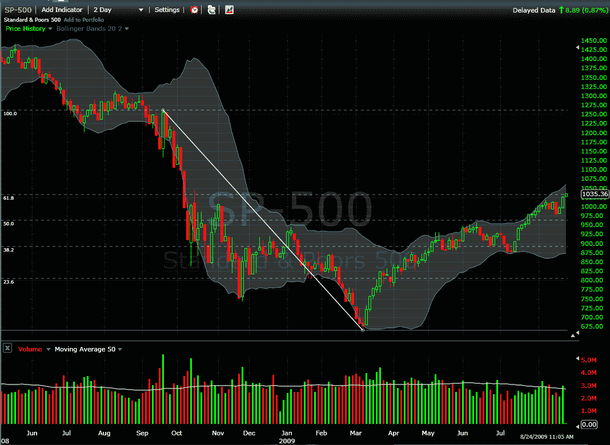

<!--yml

分类：未分类

日期：`2024-05-18 17:32:12`

-->

# VIX and More: SPX at Post-Lehman Fib Retracement Target of 1035-1037

> 来源：[`vixandmore.blogspot.com/2009/08/spx-at-post-lehman-fib-retracement.html#0001-01-01`](http://vixandmore.blogspot.com/2009/08/spx-at-post-lehman-fib-retracement.html#0001-01-01)

在这个空间里已经有过几篇文章（见下文）讨论了标普 500 指数的斐波那契回撤问题。在对话中，我一直主张将后雷曼高点与三月低点结合起来，以得出一组后雷曼斐波那契回撤数字。取决于是否只使用蜡烛图的实体部分（开盘价和收盘价）或包括影线（增加盘中高低点），后雷曼高点的`61.8%`回撤落在`1035`到`1037`的范围内。

不久前，标普 500 指数（SPX）创下了年度新高，为`1035.82`，这使得它恰好位于后雷曼斐波那契回撤目标价位，如下图所示，该图使用相对不常见的两天蜡烛图。

我已经耐心等待了两天或更长时间的弱势和/或从高点下跌`5%`以上，以便开放一些激进的空头头寸。随着斐波那契回撤目标的达成，如果我们在本世纪开始看到某种有意义的股票弱势，我现在更有可能开始逐步建仓一些空头头寸…

想了解更多关于标普 500 指数和斐波那契回撤的相关文章，请尝试：

*[来源：FreeStockCharts.com]*
