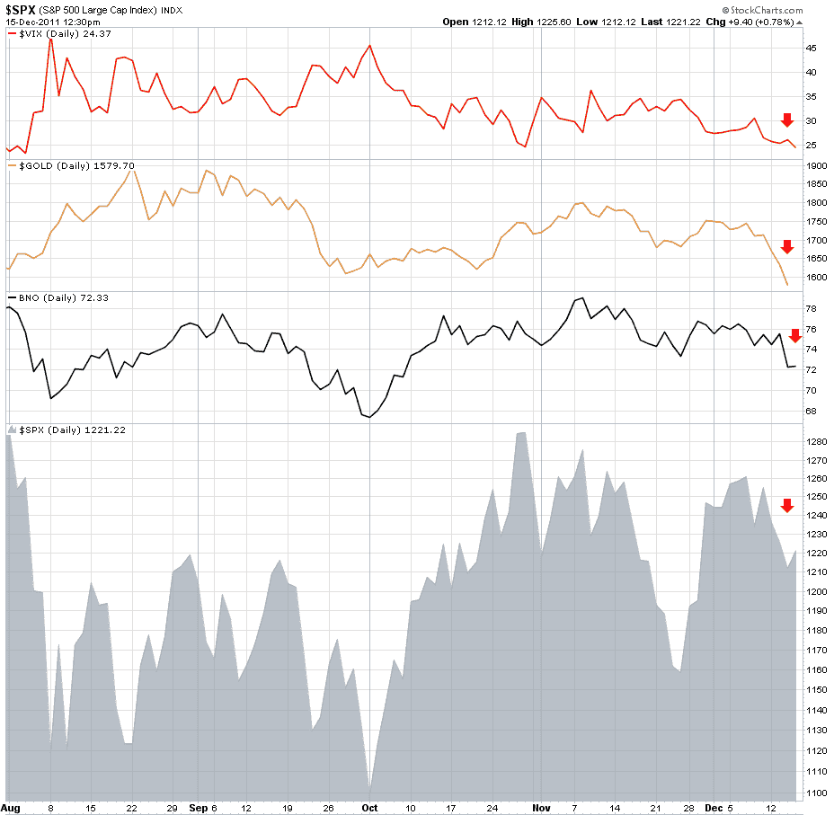

<!--yml

分类：未分类

日期：2024-05-18 16:45:54

-->

# VIX 和更多：避险期权缩水？

> 来源：[`vixandmore.blogspot.com/2011/12/safe-haven-options-shrinking.html#0001-01-01`](http://vixandmore.blogspot.com/2011/12/safe-haven-options-shrinking.html#0001-01-01)

早在 2 月，在[图表一周：避险 ETF](http://vixandmore.blogspot.com/2011/02/chart-of-week-flight-to-safety-etps.html)中，我研究了五种与避险交易有关的交易所交易产品（ETP）的今年至今表现：波动率([VXX](http://vixandmore.blogspot.com/search/label/VXX))、黄金([GLD](http://vixandmore.blogspot.com/search/label/GLD))、原油油([USO](http://vixandmore.blogspot.com/search/label/USO))、美元([UUP](http://vixandmore.blogspot.com/search/label/UUP))和美国国债([TLT](http://vixandmore.blogspot.com/search/label/TLT))。当时，人们认为[阿拉伯之春](http://vixandmore.blogspot.com/search/label/Arab%20Spring)是投资组合的主要风险，我注意到，除了原油，这些所谓的避险资产在年初的前两个月内并没有盈利。

十个月后，风险格局已经大不相同，TLT (+33.7)、GLD (+10.2%)和 VXX (+8.4%)都取得了相当可观的涨幅。虽然美元持平，但原油价格的走势取决于你观察的位置，USO 下跌了 6.0%，而[BNO](http://vixandmore.blogspot.com/search/label/bno)（衡量全球原油价格的更好指标）上涨了 15.7%。

虽然看起来避险资产在今年表现不错，但 12 月份的前两周内，这一局面发生了很大变化。特别是，隐含波动率、黄金和原油价格与股价一起大幅下跌，这三种资产都作为“负对冲”工具，对于那些试图缓冲损失而不是加剧损失的人来说，无异于雪上加霜。

在五大避险资产中，只剩下美国国债和美元在 12 月份的前半段时间内表现成功。随着美国国债利率创历史新低，似乎每个人都等待着比债券大师本人更好地时机进行比尔·格罗斯的空头交易，这使得只有那些比大多数竞争对手更少的贬值的货币剩下。

那么避险资产在哪里呢？就在几年前，许多人还认为房地产是最好的避险资产。

目前一个有趣的短期交易是[EUO](http://vixandmore.blogspot.com/search/label/EUO)，[ProShares UltraShort 欧元 ETF](http://www.proshares.com/funds/euo.html)，该 ETF 的目标是使欧元每日变动方向的变化幅度为-2 倍。

相关文章：

**

*[来源：StockCharts.com]*

****披露（s）：*** *在撰写本文时做空 VXX 和 TLT*
