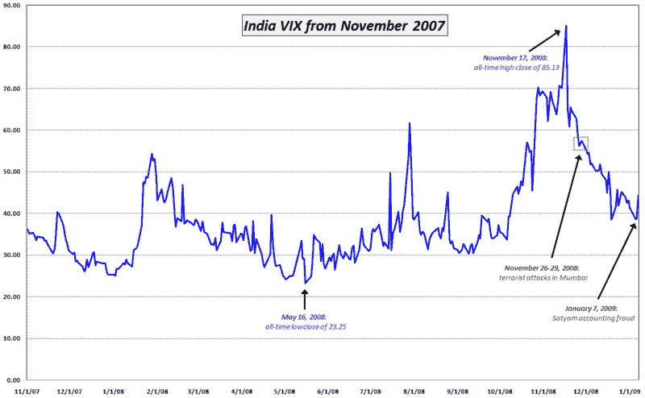

<!--yml

分类：未分类

日期：2024-05-18 18:07:11

-->

# VIX 和更多：萨蒂亚姆，欺诈和印度 VIX

> 来源：[`vixandmore.blogspot.com/2009/01/satyam-fraud-and-india-vix.html#0001-01-01`](http://vixandmore.blogspot.com/2009/01/satyam-fraud-and-india-vix.html#0001-01-01)

今天宣布，印度外包巨头萨蒂亚姆([SAY](http://vixandmore.blogspot.com/search/label/SAY))在过去几年中一直从事[大规模会计欺诈](http://www.ft.com/cms/s/0/32ea8364-dc85-11dd-a2a9-000077b07658.html)。当地交易中萨蒂亚姆下跌了 78%，拖累了孟买[敏感指数](http://vixandmore.blogspot.com/search/label/Sensex)7.3%。

综合考虑，我再次对[印度 VIX](http://vixandmore.blogspot.com/search/label/India%20VIX)的相对小幅波动感到惊讶，该指数收盘时上涨了 14.5%，达到 44.36。

下图我绘制了自 2007 年 11 月以来的印度 VIX 的走势（该指数于 2008 年 4 月推出，但历史数据已重建，向前延伸了另外六个月。）我发现印度 VIX 的规模与美国同行并没有太大的不同。我也发现，2008 年 10 月全球金融危机的担忧是波动指数高峰的原因，而随后的孟买恐怖袭击在图表上几乎只是一个微不足道的小波动。

尚不清楚萨蒂亚姆欺诈对印度股市会产生什么样的长期影响，但到目前为止，反应相对温和。

记住，在 2001 年和 2002 年多次在[市场底部](http://vixandmore.blogspot.com/search/label/market%20bottoms)失败之后，[纳斯达克](http://vixandmore.blogspot.com/2008/09/vix-spikes-and-2002-market-bottom.html)直到世界通信公司（[WorldCom](http://vixandmore.blogspot.com/search/label/WorldCom)）破产申请之后才真正触底。

来源：[印度国家证券交易所，VIX 和更多](http://vixandmore.blogspot.com/search/label/source)
