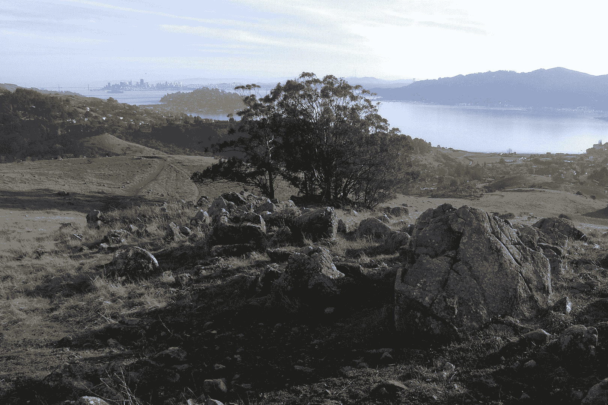

<!--yml

分类：未分类

日期：2024-05-18 17:32:48

-->

# 波动指数更多：明天在旧金山金融展览会上打个招呼吧

> 来源：[`vixandmore.blogspot.com/2009/08/say-hello-at-san-francisco-moneyshow.html#0001-01-01`](http://vixandmore.blogspot.com/2009/08/say-hello-at-san-francisco-moneyshow.html#0001-01-01)

自从我在 2007 年初开始这次博客冒险之旅以来，我有幸与全球各地不少人建立了关系。到目前为止，我只与他们中的少数人亲自见过面，但这种情况在明年会有所改变，因为我希望参加多个行业活动。明天我将在当地的[旧金山金融展览会](http://moneyshow.com/sfms/main.asp)上，位于[旧金山万豪酒店](http://www.marriott.com/hotels/travel/sfodt-san-francisco-marriott/)，并在[greenfaucet](http://www.greenfaucet.com/)的展位 (#616) 从中午直到 1:30。如果你在活动现场，想要停下来打个招呼，我很期待能见到一些名字背后的面孔。如果你在犹豫是否参加，注册是免费的（在这里注册[`secure.moneyshow.com/msc/sfms/registration.asp?sid=sfms09&newReg=t&scode=014721`](https://secure.moneyshow.com/msc/sfms/registration.asp?sid=sfms09&newReg=t&scode=014721)），由于演讲者和参展商的存在，肯定有对投资者有吸引力的内容。

当然，如果你不能来旧金山，随时给我发个消息。虽然不一定总是成功，但我尽量保持邮件和博客评论的更新。

*[旧金山 Ring Mountain, Tiburon, CA 的照片]*
